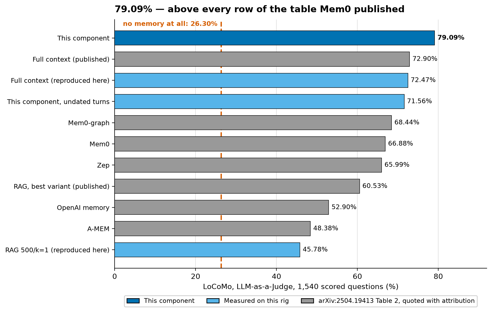
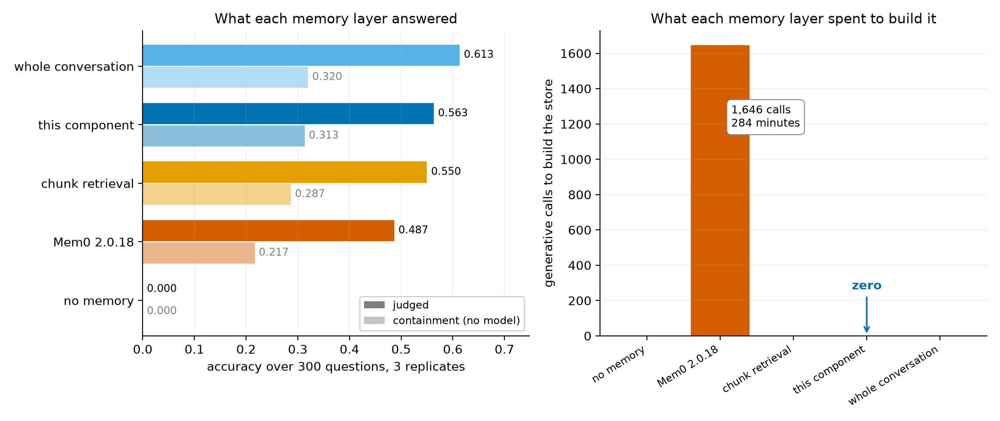
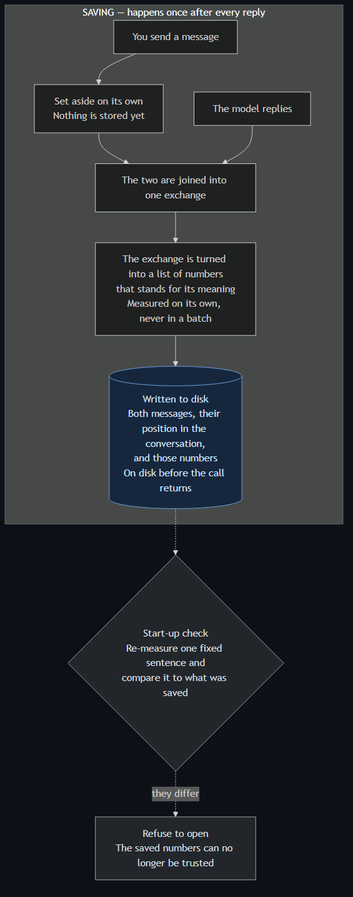
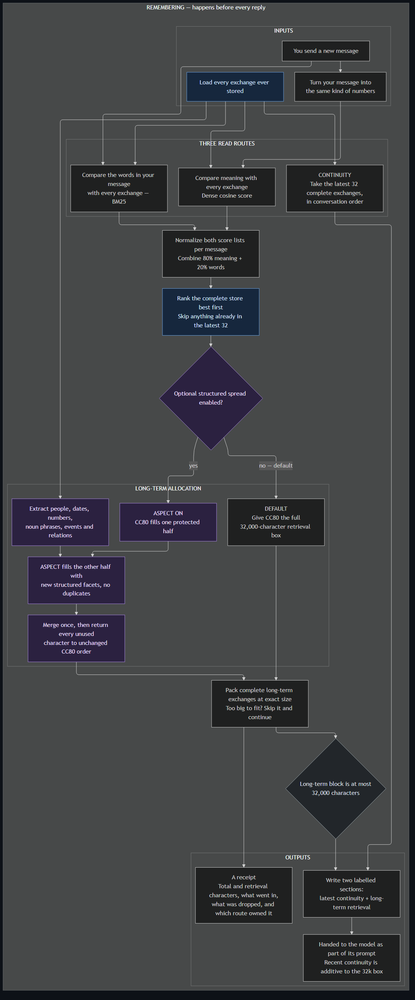

# contextDecayWindow

### → [**Read the paper: *Rank Fine, Pack Fine, Call Nothing***](paper/PAPER_002.md) · [**Download the PDF**](paper/Rank_Fine_Pack_Fine_Call_Nothing.pdf)

*Idris Applied AI Research — independent, non-profit. Failures are published with the results.*

---

## Executive Summary

**A memory layer for long conversations.** Every turn, it decides what the model
should be reminded of and fills a fixed amount of space with it — **without ever
calling a language model to help.** No summarizing, no note-taking, no rewriting.

The design copies three things human memory does, and runs all three at once:

- **Recency — what just happened.** The most recent exchanges always go in,
  automatically. You don't search your memory for what someone said a minute ago.
- **Depth — what this reminds it of.** Every exchange ever had is kept word for
  word and indexed by meaning, so mentioning *my sister's wedding* pulls back a
  conversation from six months ago. This is recall by cue, and it is where most
  memory systems stop.
- **Spread — covering ground instead of repeating it.** Rank every past exchange
  by how well it matches the question and take the best ten, and you often get
  the same fact ten times over. The space is full and the model learned one
  thing. Each slot is instead filled by asking what a candidate *adds* to what
  has already been picked, so ten slots hold ten different things.

Everything is delivered exactly as it was said, so nothing the model is told
about the past can be wrong.

### It scores 79.09% on the benchmark Mem0 published

We rebuilt the evaluation harness behind Mem0's published LoCoMo table — their
question set, answer prompt, judge prompt and metric, GPT-4o-mini as answerer
and judge — and ran this component through all 1,540 scored questions.

**Above every row of that table, on a sixth of the tokens** — 4,243 against the
25,405 of full context reproduced here. None of the systems behind those rows
was re-run.

The placement is earned by reproducing their own ceiling row first: full
context, the configuration with nothing to choose, came back at **72.47%
against a published 72.90%**. Half a point, on a 1,540-question benchmark,
against a figure published by a different team on different hardware. The judge
moved 0.06 points across two scorings of the same sealed answers.

Grey rows above were not re-run — they need vendor accounts we don't hold — so
they are quoted with attribution and nothing here is tested against them.

**And the benchmark has a 26-point floor its own paper never reports.** Run it
with an empty context and the model still scores **26.30%** — against a
contamination bar we had registered at 5%, so that gate failed. The cause is the
judge prompt, which tells the grader to accept any answer touching the gold
answer's topic. On open-domain, 841 of the 1,540 questions, the floor is
**32.34%**. It sits under every row of the published table.

### When Mem0 itself was run here

Mem0 2.0.18, installed and run on one local reader at a matched
16,000-character budget.

| | This component | Mem0 2.0.18 |
|---|---:|---:|
| Questions answered, of 300 | **0.563** | 0.487 |
| **Prompt tokens to build the store** | **0** | **5,988,818** |
| Generative calls to build it | **0** | **1,646** |
| Wall clock to build it | — | **284 min** |
| Time to assemble one context block | **10 ms** | 413 ms |
| Store size | **7.2 MB** | 42.8 MB |
| Answer reached the delivered context | **101 of 108** | 79 of 108 |

**The gap is 7.7 points — 46 gains against 23, p = 0.0038**, with a
model-free containment endpoint agreeing at **+9.7 points, p = 2.85e-05**.

**Six million prompt tokens bought Mem0 a store that finished behind.** Up to a
fifth of the answers written verbatim in those conversations never reached it:
31% of message pairs produced no memory at all, and 16 extractions returned
malformed JSON and were dropped. A verbatim store cannot lose what it was given.

### What this does not establish

- **Placement, not a head-to-head.** Mem0's published row was not re-run, and no
  test here is computed against it. Mem0 2.0.18 *was* run, locally, above.
- **Mem0 is cheaper per question** — 3,392 prompt tokens against 4,009. Ingest
  and read costs run in opposite directions, and which wins depends on a
  read-to-write ratio neither paper states.
- **Fixed-width chunk retrieval scored 0.550 against 0.563** locally, on a
  smaller store and fewer tokens per read.
- **LoCoMo fits a modern context window**, so this measures cost and accuracy,
  not reach. Not confirmatory: the corpus is spent on both splits.

### The programme behind it

Ten pre-registered studies and one registered bakeoff on a scripted 120-turn
conversation, plus component work on an extracted library and external
calibration against LongMemEval and LoCoMo. Each study adds one component and
fixes the previous one's documented failures. Designs are committed before the
run, gates are binding, and results are published as found — including the ones
that killed the thing being tested.

Four findings carry it:

1. **The model is not the bottleneck.** At the hardest probe it used 10 of 10
   delivered facts and invented none. What fails is delivery.
2. **Selection, not capacity.** All 17 target facts fit in 7,592 characters of a
   32,000-character window; the breadth bar needs 5,058. What binds is which
   candidates are chosen and in what order they are packed.
3. **Rank at the finest informative unit.** On a sealed LoCoMo holdout, ranking
   adjacent-turn pairs by their own cosine raises complete evidence delivery
   from **843 to 935 of 1,098**, p = 6.19e-12 — the programme's one confirmatory
   positive result.
4. **The live instrument is coarser than most verdicts placed on it.** Five
   byte-identical replicates scored 8.0, 8.0, 8.0, 8.0 and 11.0 on a 13-point
   rubric. Any live scored contrast under 3.0 points is *not demonstrated*.
   Offline counts are untouched: they are counts, not scores.

---

## How It Works

What actually happens, end to end, traced from the shipped library source rather
than from a design document. Two boxes are red because measurement found the
system does not behave the way its own naming suggests.

**Saving — happens once after every reply**

**Remembering — happens before every reply**

*Diagram sources: [`docs/diagrams/`](docs/diagrams/). Regenerate with*
`npx @mermaid-js/mermaid-cli -i <file>.mmd -o <file>.png -t dark -b "#0d1117" -w 1600`

*The canvas is `#0d1117`, GitHub's dark-mode background, so the diagrams sit
flush against the page there rather than showing as a panel.*

## Current State of Work

*Last updated 2026-08-22, at TC-002's verdict.*

**The tiered architecture does not earn its place on delivery.** TC-001 put the
shipped four-tier read path against the flat cosine ranking that scored 79.09%
on the published LoCoMo table, over identical candidates, vectors, renderer,
packer and budget. On 868 questions the flat arm delivered a question's complete
evidence **749 times against the tiered stack's 314** — 8 gains, 443 losses,
p = 6.98e-120 against a registered null band of 4. Every registered cut agrees:
four conversations, five categories, both endpoints, both budgets.

The composition says where it went. The recency window takes 32 of 32 episodes
on every question and **61% of the delivered characters**; the coverage selector
delivers nothing on 722 of 871 questions and carried a question's evidence on
**8**. A post-run diagnostic found why the similarity tier underperforms: it
filters by cosine and then delivers in *store order*, so the
highest-cosine qualifying episode it drops has median relevance rank **1**.

**TC-001B then took the two obvious objections away, and the gap survived one
of them.** Removing the recency tier entirely — `build_context` with
`recency_window_n=0`, relevance and coverage only — moves the tiered stack from
314 to **472** and leaves it **277 behind** the flat arm's 749. That is the
registered headline, `D3 FLAT_WINS` again. But ordering the K tier by relevance
instead of by store position is worth **276 questions** on its own, and an arm
with both changes lands at **748 against 749** — one question apart, on a
contrast that carries no bar because PF4 established before the lock that none
could fire there.

So TC-001's 435-question deficit decomposes almost exactly: **158 from the
recency tier, 276 from the order the similarity tier delivered its own members
in.** The evidence the store order was discarding sat at median cosine rank 3.

**TC-002 then asked whether the cheapest known repair transfers, and it does.**
EC-002 had moved evidence availability 32.3 points on 500 LongMemEval stores by
letting similarity candidates claim the budget before the recency window. On
four LoCoMo conversations EC-002 never saw, at its own budget and its own
endpoint, the same one-line reorder is worth **45 questions** — 732 against 687
of 871, 80 gains against 35 losses, `D1 K_FIRST_WINS` against a band of 7. The
gain generalizes.

It is also the small lever, and the same shape appears a third time. Reordering
the fill leaves the stack **110 behind** the flat arm; ordering the similarity
tier's own members best-first is worth **111** and lands within one question of
it. The two repairs are not alternatives — the 118 questions where the reordered
stack still trails flat are *exactly* the 118 that re-ranking rescues, and the
80 the reorder wins overlap none of them. Every one of the reorder's 35 losses
is a question the recency window happened to be carrying.

None of that authorizes deleting or shipping anything, and TC-002 decided the
shipping question in its registration *before* the number existed: a positive
result does not ship, because the same correction was already rejected on a live
bar. Availability is not a verdict, and LoCoMo asks questions about a finished
conversation, so a recency window is close to worthless there by construction.
What the three studies establish together is narrower and sharper: on this
corpus, the tiered machinery at its best delivers what a plain cosine ranking
delivers, at roughly four times the latency — and the lever that matters is
*within* a tier, not between tiers. TC-003 owns allocation; TC-005 owns cost;
TC-006 owns the reader. Nothing in the TC arc is blocked.

**The deployable component is done.** `episodic/` is an installable library with
a public store, report, config and embedding-cache API. Extraction is certified
behavior-preserving against committed artifacts rather than assumed; the budget
is an enforced ceiling; `append()` is durable against real process kills; and the
vector cache retains exact float32 bytes and refuses read-only misses.

**The 120-turn live arc is retired for fine contrasts.** Its measured run-to-run
band is 3.0 points on 13, and the runtime is not bit-reproducible — the same
prompt at the same seed can produce a different answer. New work is offline,
where results are counts and identities.

**Deterministic memory retrieval (DMR) arc — 6 specifications, 4 run.**

| stage | state |
|---|---|
| DMR-001 event formation | stopped at G3; the size cap became the partitioner |
| DMR-001B adaptive drift | passes all gates, no sealed holdout, characterized |
| DMR-001C sealed confirmation | transfer confirmed on 50 real conversations; boundary claim fails on recall |
| DMR-004 query-obligation compiler | stopped on its sealed holdout; J .320 against a .50 bar |
| DMR-002, DMR-003 | upstream dependency cleared, but **not executable yet** — both remain design-only with no Part 1 or pre-registration |
| DMR-005, DMR-006 | blocked by their own dependency lines |

**Novelty-floor (NF) diagnostic line — offline, zero model calls.**

- **NF-001** stopped on the instrument, not the mechanism: never-stop was optimal
  under the tested rule, so the rule could not be measured.
- **NF-002** built an instrument that prices displacement, and found novelty
  filtering to be a measured null. Its registered session-touch contrast gained
  16 items; the posthoc strict audit retains a 13-item net gain.
  `CARRIES_SIGNAL`, capped at `CHARACTERIZED` by a recorded deviation.
- **NF-003 Part 1** stopped at its pre-registration surrogate audit. Session-touch
  reproduced 396 → 445 and 49 gains/0 losses, but strict answer-episode delivery
  fell 388 → 351 with **26 gains and 63 losses**. It remains unregistered.
- **Three-arm synthesis** puts both levers on one strict scale: session/session
  375, session/episode 388, episode/episode 351. The deployed middle corner is
  the observed optimum: **rank coarse, pack fine**.
- **LoCoMo development** supplies the untouched-corpus successor signal. Across
  871 unique questions, strict exact-evidence delivery rose 820 → 855 with
  **44 gains and 9 losses**; all four development conversations were positive.
  This is exploration only, with no locked bars or disposition.
- **Budget controls** reject the slack-budget explanation and a universal
  binding-ratio rule. At 32k, LoCoMo source/session/pair all-evidence is
  279/773/826; LongMemEval all-evidence changes sign between 16k and 24k while
  LoCoMo remains positive at overlapping ratios.
- **NF-004** is `WORKS`, availability only. On 1,098 sealed LoCoMo questions at
  16k, pair ranking raises complete evidence from 843 to 935 over session-score
  inheritance: **140 gains, 48 losses, ratio 2.92, p=6.19e-12**. All six
  conversations are net positive; source order reaches only 258, and the 32k
  secondary remains positive at 961 to 1,024. G0-G7 and byte replay pass.
- **NF-005** is `INFORMATION_DILUTION_SUPPORTED`, capped at `CHARACTERIZED`.
  On the same 465 LongMemEval items and 32k budget, with turn packing fixed,
  ranking 298-character median source turns by their own cosine raises any exact
  evidence from 361 to 461: **100 gains, zero losses, p=7.89e-31**. All-evidence
  rises 208 to 454; source order reaches only 64/7. This supports candidate
  localization/dilution as the moderator, not a raw character threshold.
- **NF-006** is `INTERNAL_DILUTION_RESCUES_Q11`, capped at `CHARACTERIZED`.
  On the internal 121-turn store, episode/inherited-statement/own-statement
  availability is **12/7/14 of 17**. Own-statement ranking restores monetary
  4/4 and ties the episode control at 21/21 targeted items with zero losses.
  No selected treatment statement comes from turn 90, so the store-level
  moderator is supported while DX-001's exact carrier remains unresolved.
- **NF-007** stops as `FLOOR_INERT` before full registration. The sealed NF-006
  T1 selection already touches all 16 carried clusters, so a hard floor of one
  per nonempty cluster forces zero admissions. Renaissance-art episodes supply
  194/791 statement candidates (24.5%) while T1 delivers 1/4 art facts. Cluster
  0 is sampled 30/91 (33.0%), versus 9/168 (5.4%) across the five art-majority
  clusters. Candidate scarcity, statement subdivision, and cluster entry do not
  explain the remaining art loss; the carried coverage-count family is closed.

**One constraint governs that whole line.** Every LongMemEval item has now been
used by this program, so nothing in it can be *confirmed* on that corpus.
Characterization is the ceiling there. LoCoMo was split by whole conversation
before content inspection and its six-conversation holdout has now been used by
NF-004; further work on these ten conversations is characterization, not a new
confirmation.

---

## Next Steps

1. **Register TC-003 with the competitor three studies have now measured.** Its
   reserved-floors proposal addresses allocation *between* tiers. TC-001B put
   that at 158 questions of TC-001's 435; TC-002 put reordering the fill at 45
   against 111 for ordering the similarity tier's own members, and showed the
   two act on disjoint question sets. Floors do not touch the within-tier
   quantity, and it has been the larger one every time it has been measured.
   TC-003 should say which it is testing before it runs. The composition,
   K-tier-order, four-arm and fill-order artifacts under
   `experiments/components/tier_cost/` are where the case starts.

2. **Register item-level reader validation before any live inference.** TC-006's
   fact-use instrument over two frozen contexts, whose own first task is
   measuring whether its resolution beats the margin it must test. Compare
   NF-006's frozen 12/17 and 14/17 Q11 contexts using five replicates per arm and
   a 17-item fact-use instrument. The reader, exact prompt, replicate schedule,
   scorer, and paired bar remain to be locked; `nf_008/` is design-only.

3. **Write DMR-002 Part 1 and its final pre-registration before implementation.**
   The former is upstream-cleared, but the only spec still forbids execution.

4. **Treat candidate informativeness as the ranking scope condition.** Rank at
   the finest unit whose embedding remains informative and pack at the finest
   affordable unit. A controlled padding/aggregation study on an untouched
   corpus is still needed to separate raw length from semantic localization.

5. **Stop optimizing Q11 with coverage counts on this store.** The carried
   `k=16` selection already enters every region, and finer statements do not
   repair art. Statement-grain temporal adjacency is a grounded but separate
   availability successor; it is not part of the prepared live reader study.

---
---

# For LLM Context

**Everything below this line is the full record.** It is written for an agent
picking up this work with no prior context, and it is deliberately dense: every
claim carries its numbers and its artifact path so that a result can be checked
without opening the study. It is not meant to be read top to bottom by a human.

Start with `AGENTS.md` — it is the operating manual and the study digest — and
read `ERRATA.md` before quoting any number.

## Status Ledger

**Can a language model hold a long conversation by rebuilding a small, relevant context every turn, instead of re-reading the whole transcript or summarising it away?**

Eleven pre-registered studies test that question, each adding one memory component and fixing the prior study's documented failures. Every result is published as found.

> **Status:** Study 010 stopped at G2; exploratory continuation unaudited and LTM budget-noncompliant | retrieval bakeoff complete | retrieval mechanism ledger reopened for Family CS; E005 is killed by LV-001's live targeted-regression bar, DX-001 closes NO CHANGE, RD-001 stops before correlation because unchanged rarity scores cover only 6/76 fact-bearing episodes, and chained retrieval Rev5 is CHARACTERIZED offline at 9/17 versus X0 6/17 but misses art 0/4 and has no targeted no-regression arm | EC-001 LongMemEval complete: inversion not dominant, Codex-substituted score only | EC-002 complete: K-first packing raises any-session recall 109/470 -> 261/470 offline; no production promotion authorized | IC-001 Branch A: the same gate is closed internally — K delivered nothing at 8/8 probes under the deployed order; Q11 6/17 -> 7/17, targeted 14/21 -> 18/21, zero losses; cache clause substituted under authorized Amendment 001; no recalibration authorized | Study 011 tests both halves live and splits them: the deployed arm scores identically to recency-only on all 13 questions, so the similarity tier is inert in deployment, but K-first raises availability and scores 7.0 vs 8.0 — B1 FAILS and the packing correction is not adopted; post-unseal analysis finds the N tier is a least-recently-delivered rotation over the whole store, not a recency window, and that the rule every live run through Study 010 used was a block locked onto the conversation's first nine turns; three different rules carry that name and only the extracted library's is a window | Amendment 001 authorized and run: the instrument's run-to-run band is **3.0 points on 13**, measured by five identical arm-D replicates that score 8.0, 8.0, 8.0, 8.0 and 11.0 — a switch, not a spread, since four are byte-identical across 121 turns and the one meeting an empty server slot diverges at turn 1; Study 009's 3.0, LV-001's -2.0 and Study 011's -1.0 are all re-read as **not demonstrated**, while every offline count is untouched and B1 stays fired | CC-002 extracts the deployable component into `episodic`; CC-006 adds exact hashed vector-cache reuse | PS-001 CHARACTERIZED: the selected sparse cell stores and recovers 119/119 codes through 50% registered swaps | PS-002 stops at Part 1: best natural-language binder reaches stored codes in 190/192 rounds but retains one cycle and one spurious fixed point, so labels, answers, and live scoring are not entered | deployment closeout complete | PAPER-002 supersedes PAPER-001 (2026-08-18): same numbers, reordered to lead with the sealed LoCoMo holdout, with a four-level standing taxonomy in `paper/notes/EVIDENCE_SPINE.md`, a withdrawn-claim list in `paper/notes/DO_NOT_WRITE.md`, and every number gated by `scripts/check_paper_002_claims.py`; PAPER-001 retired | scoring/interpretation record corrected through 2026-08-05

> **TC arc status:** `TC-001 REPORTED D3 FLAT_WINS; TC-001B REPORTED C1 D3 FLAT_WINS; TC-002 REPORTED C1 D1 K_FIRST_WINS; TC-003 THROUGH TC-006 DESIGN ONLY`.
> The arc asks whether the tiered stack earns its place before asking how to tune
> it. TC-001 ran the shipped `build_context` against `CdwArm`'s flat cosine
> ranking over identical candidates, vectors, renderer, packer and 16,000-character
> budget on 868 LoCoMo development questions: complete evidence 749 flat versus
> 314 tiered, 8 gains, 443 losses, net -435 on 451 discordant pairs,
> one-sided exact binomial p=6.98e-120 against a measured null band of 4. The
> 32,000 secondary narrows the gap to -177 without closing it; the wrapper-matched
> robustness check reproduces the primary exactly. Recency takes 32/32 episodes
> and 61% of delivered characters on every question; coverage delivers nothing on
> 722/871 and carries evidence on 8. `REGISTERED-OFFLINE`, availability only, no
> adoption or deletion authorized. A DESCRIPTIVE post-run diagnostic finds the K
> tier filters by cosine and delivers in store order — 824/827 questions match the
> conversation-order prefix, 0 match the cosine top-n, and the best qualifying
> episode it drops has median relevance rank 1. Preflight Part 1 checked tier
> membership and never asked tier ordering; that gap is recorded in the report.
> Rule 4's dependency re-read logged no block.
> `experiments/components/tier_cost/TC_001_REPORT.md`.

> **TC-001B (2026-08-22), escalated from TC-001 Amendment 001.** The author asked
> for a dual arm of relevance and coverage only, on the grounds that recency was
> built for a conversational use case; `AGENTS.md` §5 makes adding an arm a new
> study, so it was escalated rather than folded in. Four arms over TC-001's
> frozen corpus, cache, renderer, packer and budgets; G0 reproduced TC-001's four
> committed rows exactly before the run phase opened. C1, the registered
> headline: `A_DUAL` (`recency_window_n=0`) delivers complete evidence on 472/868
> against `A_FLAT`'s 749 — 14 gains, 291 losses, net -277, p=8.23e-69 against
> band 4, Bonferroni α=0.0025 over four contrasts. **D3 FLAT_WINS.** C2: the
> recency tier cost 158 questions (472 vs 314, D1 DUAL_WINS). C4: offering the K
> tier best-first is worth 276 (748 vs 472, D1 RANKED_WINS), so TC-001's -435
> decomposes as 158 + 276. C3 (`A_DUAL_RANKED` 748 vs `A_FLAT` 749) carries **no
> bar**: PF4 measured 3 discordant pairs with the direction withheld before the
> lock, which puts its best attainable p at 0.125 and makes any bar unreachable
> by construction — predicted 3, observed 3. C1's 291 losses sit at worst-evidence
> cosine rank p50 3; C4's 289 gains are the same pairs at the same ranks.
> Unstarved coverage carries evidence alone on 12/871, up from 3, and removing a
> tier buys no latency back (92-97ms vs the flat path's 14). All four
> conversations, five categories, both endpoints, both budgets agree; the
> wrapper-matched C2 check reproduces exactly. `REGISTERED-OFFLINE`,
> characterization only — the arms were chosen after TC-001's result was known,
> and `recency_window_n` stays at 32.

> **TC-002 (2026-08-22), the arc's second numbered stage.** Roadmap §3's
> question: does EC-002's fill-order availability gain hold off its original
> corpus? EC-002 moved any-evidence-session recall 109 -> 261 of 470 on 500
> LongMemEval stores by giving K-threshold candidates admission priority over
> the recency window. TC-002 replays that manipulation — `build_k_first_context`
> imported unmodified, with `git diff` against `caa19f52` empty on all six files
> of the K-first path — on four LoCoMo development conversations, at EC-002's own
> 32,000-character budget and its own any-evidence endpoint. Five arms, four
> contrasts, C1 registered as the headline before the run. **C1: `A_K_FIRST`
> 732/871 vs `A_N_FIRST` 687 — 80 gains, 35 losses, net +45, p=1.64e-5 against a
> band of 7. D1 K_FIRST_WINS: the gain transfers.** C2: `A_K_FIRST` is still 110
> behind `A_FLAT`'s 842 (D3 FLAT_WINS). C3: deleting the recency tier beats
> deprioritizing it by 8 (740 vs 732, p=0.0107, **D2 DUAL_WINS_CARRIES_SIGNAL** —
> the registered lower tier firing, 10 discordant pairs, exactly the count PF4
> predicted). C4: ordering the K tier best-first is worth 111 (843 vs 732, D1
> RANKED_WINS) and lands one question past `A_FLAT`. **C2's 118 losses and C4's
> 118 gains are the identical 118 questions; C1's 80 gains overlap none of them**
> — reordering the fill and re-ranking the tier repair disjoint populations. All
> 35 of C1's losses are recency-carried evidence; its 80 gains sit at worst-
> evidence cosine rank p50 3. C3's 9 gains are carried by coverage alone at rank
> p50 85, the only place any study in this arc finds that component supplying
> something no other path does. Magnitude does not transfer as direction does:
> +32.3 points on LongMemEval against +5.2 here at the matched budget and +15.8
> at 16,000, and **no binding-ratio explanation is offered** — `DO_NOT_WRITE.md`
> #32 refuted that law. The null band is measured per budget for the first time
> in this arc and is **7 at 32,000 against 4 at 16,000**, the noisiest arm being
> the shipped configuration and the quietest `A_DUAL_RANKED` at 0-1; recomputing
> every contrast at band 4 changes no disposition, so the wider band cost this
> study nothing but would have decided a smaller one. Reordering the fill costs
> 1-3 ms. Direction is consistent in all four conversations and all five
> categories; the wrapper-matched pass reproduces C2, C3 and C4 exactly. Roadmap
> §10 item 4 is **retired**: the registration decided before the run that a
> positive result does not ship, and it does not. `REGISTERED-OFFLINE`,
> characterization only. `experiments/components/tier_cost/TC_002_REPORT.md`.
> `experiments/components/tier_cost/TC_001B_REPORT.md`.

> **Current component status:** SUP-001 passes all offline P5/P9 supersession
> gates and the 35-turn reader ablation; no 120-turn run or adoption is automatic.

> **SUP-001 status:** `FACTUAL PASS - BYTE-IDENTITY CRITERION WITHDRAWN`.
> Explicit accessibility changes current-only retrieval 0/64->64/64,
> preserves 32/32 unchanged facts, recovers 64/64 histories, and removes all
> stale natural selections. Value-level interpretation gives C0 8/9
> and T1 9/9 with zero regressions. Explicit supersession passes integration;
> broader live evaluation remains a separate decision.

> **DMR arc status:** `DMR-002/003 UPSTREAM-CLEARED; NOT PRE-REGISTERED`.
> Six implementation specifications separate event formation, typed pattern
> completion, encoding-context recurrence, query-obligation compilation,
> deterministic route control, and single-reader validation. DMR-001 stopped at
> G3 and DMR-004 stopped on its sealed holdout. A blocking review
> (`DMR_ARC_BLOCKING_REVIEW.md`) re-read every dependency line and found two
> stages had been blocked upstream in error: DMR-002 and DMR-003 consume the frozen
> DMR-001B former, whose operating point DMR-001C confirmed on a sealed
> holdout, and neither needs the boundary claim that failed. DMR-005 remains
> blocked by its own dependency line, since DMR-004 produced no passing plans.
> Both cleared stages remain design-only and cannot execute before Part 1 and
> final pre-registration, and DMR-006 needs DMR-005. The roadmap starts at
> `experiments/components/biological_memory/deterministic_retrieval/DMR_ARC_IMPLEMENTATION_ROADMAP.md`.

> **DMR-001 status:** `DEGENERATE_FORMATION - G3 FAIL - CHARACTERIZED`. On the
> 2,000-episode sealed holdout, 52 of 74 events close because the size cap
> binds, a forced fraction of 0.703 against a bar of 0.35. The drift predicate
> is precise and barely fires: all 20 of its holdout boundaries match an
> annotation, while none of the 52 forced boundaries do. The locked threshold
> of 0.70 sits above the holdout's 95th drift percentile yet fires on 18.5% of
> eligible development episodes, so an absolute drift threshold is not a
> transferable quantity and the safety cap becomes the partitioner. G1, G2 and
> PF1-PF10 pass; G4 and G5 were not evaluated.

> **DMR-001B status:** `ADAPTIVE_FORMATION_TRANSFERS_OFFLINE - CHARACTERIZED`.
> Replacing the fixed drift threshold with a percentile of the conversation's
> own recent drift holds the fire-rate swing between corpora at 1.42-1.65x
> across every cell of the registered grid, where the fixed rule swung tenfold
> or died. The size cap, set to 128 as a guard, never bound once in 3,724
> episodes. Worst-family agreement rises .419 to .487, though the 1,000-turn
> family falls .733 to .583. There is no sealed holdout and the ordering
> deviation `DEVIATION_001` is recorded, so this is not confirmatory and does
> **not** unblock DMR-002.

> **DMR-001C status:** `NO_BOUNDARY_EVIDENCE - G5 FAIL, G4 CONFIRMED`. A
> genuine sealed holdout: the rule was frozen at DMR-001B's anchor before
> LongMemEval was re-fetched, and the registration commit carries no
> implementation file. Across 50 unread haystacks, 11,453 episodes and 2,128
> real session seams, the relative bar holds its per-stream fire rate at a
> p95/p05 ratio of 1.67x, confirming transfer on real conversation where the
> fixed threshold swung tenfold on synthetic scripts. Boundary agreement fails:
> precision is .837 against a .186 base rate but recall is only .253, because
> `min_event_size` 5 cannot resolve seams in six-exchange sessions, so macro F1
> .387 loses to fixed chopping at .606. Macro F1 was a poor statistic for a
> corpus with an 18.6% base rate; that defect is recorded, not re-scored.

> **DMR-004 status:** `NO_MECHANICAL_SUFFICIENCY_SIGNAL - STOP - CHARACTERIZED`.
> A model-free precedence parser over query text alone, gated on Youden's J so
> that no base rate could carry it. On a sealed holdout of 180 queries labelled
> by two blind raters, J is 0.320 against a bar of 0.50 and the false-finite
> rate is 0.188 against 0.15, so the registered joint condition fails. `LOOKUP`
> recall 0.800, span integrity 1.000 and marker independence 0-of-48 all pass.
> The misses are structural, not scattered: 12 of 31 are *"which happened first,
> A or B"* - a bounded two-item obligation the registered class set cannot name,
> flagged in writing before the compiler existed and deliberately not patched -
> and 3 more are `HISTORY` queries the compiler classifies correctly but the
> registered `NOVELTY_ONLY` mapping scores as failures. Answering "I cannot
> tell" to everything scores 0.650 accuracy against the compiler's 0.706, which
> is why accuracy was barred from passing anything. Two raters agree with each
> other at J≈0.76. Per specification §12 a model-free adaptive controller is not
> authorized, and the compiler must not be replaced with a second model call.

> **NF-002 status:** `CARRIES_SIGNAL - CHARACTERIZED`. Same ranking, same
> 32,000-char budget, same skip-on-overflow policy; the only change is the
> candidate unit. Episodes instead of sessions raise any-evidence recall on 470
> LongMemEval items from 380 to 396 and all-evidence from 210 to 261. On the
> registered holdout the primary measure is 14 gains against 6 losses, ratio
> 2.33 over a bar of 2.0, p=0.058 against 0.05 - the lower tier, which was
> registered before the number existed and whose firing was predicted verbatim
> in the registration. All six losses in the entire study sit in
> `single-session-assistant`, which records zero gains; the other five strata
> are gains-only. Marginal novelty filtering is a measured null, recovering 0 of
> the 90-item headroom at every floor. 89 of 90 baseline misses have evidence
> within reach at median rank 7, skipped on cost. `DEVIATION_001` caps this at
> characterization: the holdout counts were seen before the bars were locked.

> **NF-003 status:** `PREFLIGHT SURROGATE FAIL - UNREGISTERED`. NF-002 changed
> the packing unit and left the ranking unit alone, so episodes still inherited
> their session's rank; 74 of 90 baseline misses survived every unit and packing
> change. Ranking at episode granularity, same budget and same packing policy,
> session-touch rises 396 -> 445 on 465 evaluated items with 49 gains/0 losses.
> PF9 found that 94 treatment hits contain no `has_answer` episode. Under strict
> answer-episode delivery, baseline 388 falls to 351, with **26 gains and 63
> losses**. Five unflagged items were not ranked. The proposed registration
> closed before lock; no posthoc disposition, live run, or adoption follows.

> **NF-003 three-arm finding:** `CHARACTERIZED ON EXHAUSTED LONGMEMEVAL`.
> Strict delivery is 375/465 for session-rank/session-pack, 388/465 for
> session-rank/episode-pack, and 351/465 for episode-rank/episode-pack. Fine
> packing is net +13; fine ranking is net -37. The 63 coarse-rank rescues have
> median own-cosine rank 46 (p90 135), versus 10 (p90 21) for the 26 fine-rank
> gains. Design rule: **rank coarse, pack fine**. No posthoc verdict is assigned.

> **LoCoMo ranking-granularity development status:** `DEVELOPMENT SIGNAL;
> HOLDOUT LATER USED BY NF-004`. On 871 unique questions, exact evidence-pair delivery rises
> 820 -> 855 with 44 gains/9 losses (descriptive exact sign p=1.22e-6); complete
> evidence delivery rises 773 -> 826 with 71/18. All four conversations are net
> positive. Session-touch hides all nine strict losses. No bars or disposition
> were registered at this stage; NF-004 later opened the locked holdout.

> **LoCoMo control status:** `COMPLETE - CORPUS-SPECIFIC REGISTRATION
> JUSTIFIED`. At 32k, source/session/pair complete-evidence delivery is
> 279/773/826. Pair ranking beats session ranking at every truncated LoCoMo
> budget, while LongMemEval complete-evidence crosses sign between 16k and 24k.
> Opposite signs occur at overlapping binding ratios, so ratio alone does not
> transfer. Zero model calls; byte-identical replay.

> **NF-004 status:** `WORKS - CONFIRMED AVAILABILITY DIRECTION`. On 1,098
> sealed LoCoMo questions at 16k, pair ranking raises complete exact-evidence
> delivery from 843 to 935 over session-score inheritance: 140 gains, 48
> losses, ratio 2.92, one-sided exact p=6.19e-12. All six conversations are net
> positive; source order is 258 and 32k remains positive at 961 to 1,024.
> G0-G7 pass with a byte-identical holdout replay and zero measurement calls.
> Availability is not reader correctness; no live run or adoption follows.

> **NF-005 status:** `INFORMATION_DILUTION_SUPPORTED - CHARACTERIZED`. On the
> same 465 LongMemEval items at 32k, with source-turn packing fixed, own-turn
> ranking raises any exact evidence delivery from 361 to 461: 100 gains, zero
> losses, one-sided exact p=7.89e-31. All-evidence rises 208 to 454; source order
> reaches 64 any and 7 all. Evidence turns have median 298 characters versus
> 2,550 for parent evidence episodes. G0-G8 and byte-identical outcome replay
> pass. This supports information dilution/localization, not raw-length
> causality, reader correctness, a live run, or adoption.

> **NF-006 status:** `INTERNAL_DILUTION_RESCUES_Q11 - CHARACTERIZED`. On the
> internal 121-turn store at 32k, Q11 availability is 12/17 for episode
> rank/pack, 7/17 for inherited rank with statement packing, and 14/17 for
> own-statement rank/pack. T1 restores monetary 4/4; targeted is 21/21 in both
> C0 and T1 with zero losses. No selected T1 statement is from turn 90, so the
> store-level dilution result does not identify DX-001's exact carrier. No
> reader, live, or adoption claim follows.

> **NF-007 status:** `STOP - FLOOR_INERT`. Part 1 finds 194/791 statement
> candidates inherit the renaissance-art label, but NF-006's sealed T1 already
> touches all 16 carried clusters. A hard floor of one per nonempty cluster
> forces zero admissions and cannot distinguish treatment from control. Cluster
> 0 supplies 30/80 selections while five art-majority clusters supply 9/80 from
> comparable candidate mass. The carried coverage-count family is closed. The
> study stops before full registration, selector implementation, or Q11 outcome
> measurement; this is an instrument/design stop, not a binding-floor failure.

> **SAL-001 status:** `NO_INDEPENDENT_PROXIMITY - CHARACTERIZED`. On 92
> held-out LongMemEval sessions, adjusted neighbor AUC is 0.416 (95% interval
> 0.351-0.484; one-sided p=0.991), raw AUC 0.300, prior 0.399, and next 0.477.
> Posthoc own-exchange surprisal is 0.621: surprise stays local rather than
> transferring to neighbors. P1-P4 capture is killed; P5/P9 supersession is
> unaffected.

> **SR-001 status:** `NO_BROAD_GAIN - CHARACTERIZED`. With source ranks fixed,
> spans reduce Q11 8/17->4/17 and targeted facts 19->17, producing 0 gains,
> 2 losses, and 22 ties. The historical span benefit requires span-level
> ranking or selection; representation alone does not earn an ablation.

> **TA-001 status:** `TARGETED_REGRESSION - CHARACTERIZED`. Q11 packed facts
> rise 7/17->9/17 and art 0/4->4/4 under matched 15-candidate and 32k limits,
> but 24 targeted queries yield 2 gains, 6 losses, and 16 ties. G5 blocks the
> 35-turn ablation, live evaluation, promotion, and adoption.

> **PS-003 status:** Safe ambiguity resolution passes, but G3 fails. Lookup
> remains `7/12`, identical to direct cosine and PS-002, with monetary at
> `1/3`. No answer generation, live score, promotion, or adoption follows.

> **E006-P3 closeout:** Query-anchored associative-frontier retrieval is
> `NO_DIFFERENTIATED_CUE - CHARACTERIZED`: 5/17 packed facts at primary
> `D=2, m=5`, versus A0's 7/17 and A1's 9/17; no targeted claim, live run,
> promotion, or adoption.

> **BA-001 causal audit:** `CHAIN_PACKING_ONLY_GAIN - CHARACTERIZED`. At
> matched 15-candidate volume, fixed-query and chained retrieval expose the
> same 9/17 facts; chaining packs 9 instead of 7. Radius-1 adjacency reaches
> turn 55 and all four art facts as an oracle ceiling. No live run or adoption.

> **E006-P3 Rev4 construct repair:** `PATTERNS_NOT_STORED - CHARACTERIZED`.
> Canonical Hebbian recurrence stores 0/119 real episode codes as fixed points
> and converges into six spurious attractors. Preflight stops at Part 1; the
> original P3 result is unchanged and Q11 is not entered.

> **PS-001 pattern-separated engram formation:**
> `SPARSE_ENGRAM_CANDIDATE_CHARACTERIZED`. Of nine deterministic sparse cells,
> only `(4096, 41)` passes G3-G5: `119/119` fixed points and exact recovery at
> one swap, 10%, 30%, and 50%. The union-biased degenerate cue cycles. This is
> code-space characterization only; no natural cue, retrieval, live run,
> promotion, or adoption follows.

> **PS-002 natural-language cue binding:** `NATURAL_CUES_NOT_BOUND -
> CHARACTERIZED`. The strongest label-blind cell reached stored engrams in
> `190/192` rounds, but one cue cycled and one reached a spurious fixed point.
> No cell emitted eight clean identities for every query, so relevance labels,
> answers, live scoring, promotion, and adoption were not entered.

> **PS-003 ambiguous cue resolution:** `LOOKUP_BINDING_INSUFFICIENT -
> CHARACTERIZED`. The selected five-probe, four-swap resolver emitted eight
> unanimous stored identities for all 24 queries while rejecting unsafe or
> disagreeing families. Lookup evidence remained `7/12`, exactly matching
> direct cosine and PS-002; monetary remained `1/3`. G4/G5, stress tests,
> answers, live scoring, promotion, and adoption were not reached.

## The Problem

A long conversation forces a bad trade. Keep the full transcript and the model gets slower and loses the middle. Summarise it and details disappear permanently.

## The Approach

Store every exchange as an episode. Each turn, retrieve recent and semantically similar episodes and construct a small context. Then add one memory component per study and measure its effect: long-term storage, retrieval, consolidation, and budgeting.

Runs use a scripted 120-turn conversation with facts planted at known positions and a rubric locked since Study 002.

## What Has Been Tested

| # | Added | Result | Finding |
|---|---|---|---|
| 001 | Recency and similarity retrieval | PARTIAL (2/3) | Similarity fired once in 32 turns |
| 002 | Consolidation, rule pinning, 120 turns | PARTIAL (3/4) | Similarity recovered buried facts; consolidation produced 52 topics |
| 003 | LTM write path | PARTIAL (2/3) | Promotion behaved as novelty detection, not salience judgment |
| 004 | LTM read path and arbitration | PARTIAL (1/3) | Retrieval worked, but the store lacked useful planted facts |
| 005 | Permissive capture and extractive dreaming | PARTIAL | Entity and number counts selected verbosity |
| 006 | Length-normalised sentence selection | PARTIAL (1/3) | Formation reached all domains, but small records broke count budgeting |
| 007 | Information-sized retrieval budget | PARTIAL (2/3) | Best score; the model used every delivered fact |
| 008 | Rendering by selection factorial | STOPPED AT GATES | No jointly feasible operating point existed |
| 009 | Pure-STM null test and topic digest | PARTIAL; null decisive | LTM beat STM by 3.0; digest failed its offline gate |
| 010 | 1,000-turn endurance | STOPPED AT G2; EXPLORATORY CONTINUATION COMPLETE | LTM won breadth in a budget-noncompliant arm; targeted tied; Bar 3 NOT EVALUABLE |
| PS-001 | Sparse pattern-separated engram formation | CHARACTERIZED | One of nine cells stored and recovered 119/119 codes through 50% registered swaps; natural cues and retrieval remain untested |
| PS-002 | Natural-language cue binding to sparse engrams | STOPPED AT PART 1; CHARACTERIZED | Best cell reached stored codes in 190/192 rounds but retained one cycle and one spurious fixed point; relevance and answers not entered |
| PS-003 | Ambiguous natural-language cue resolution | G3 FAIL; CHARACTERIZED | Five-probe consensus safely emitted 8 identities/query, but lookup stayed 7/12, identical to cosine and PS-002; monetary 1/3 |
| BA-001 | Chained-retrieval and benchmark causal audit | CHARACTERIZED | Matched-volume chaining discovered no new facts; its 7/17 to 9/17 gain was packing only. Art was stored and directly recallable but not broadly cued |
| TA-001 | Radius-1 temporal-adjacency bridge | G5 FAIL; CHARACTERIZED | Q11 packed facts rose 7/17 to 9/17 and art 0/4 to 4/4, but targeted queries had 6 losses versus 2 gains; no ablation or live run |
| SR-001 | Source-rank-preserving extractive spans | G3 FAIL; CHARACTERIZED | Fixed-rank spans reduced Q11 8/17 to 4/17 and targeted matched facts 19 to 17, with zero gains. BA-001's span signal came from span-level ranking, not representation alone |
| SAL-001 | Independent surprisal-proximity diagnostic | G2 FAIL; CHARACTERIZED | Adjusted neighbor AUC was 0.416, raw 0.300, prior 0.399, and next 0.477. Own-exchange surprisal was 0.621 posthoc, so surprise marked content locally but did not transfer value to temporal neighbors |
| DMR-001 | Online event-context formation over pinned embeddings | G3 FAIL; DEGENERATE_FORMATION; CHARACTERIZED | The size cap, not the drift detector, did the partitioning: 52 of 74 holdout events closed on `max_event_size` and matched no annotation, while all 20 drift boundaries matched one. The locked threshold fires on 18.5% of development episodes and 1.2% of holdout episodes, so drift has no transferable scale. Its original absolute rule is closed |
| DMR-001B | Adaptive drift event formation | PASS; CHARACTERIZED | A percentile-of-recent-drift bar held the cross-corpus fire-rate swing at 1.42-1.65x where the fixed threshold swung tenfold, and the size cap never bound. Worst-family agreement .419 to .487; the 1,000-turn family fell .733 to .583. Its frozen former clears DMR-002/003's upstream dependency, not their missing registrations |
| DMR-001C | Sealed confirmation of the relative drift rule | G5 FAIL; G4 CONFIRMED | On 50 unread LongMemEval haystacks the frozen rule held its fire rate at a 1.67x p95/p05 ratio, confirming transfer. Precision .837 against a .186 base rate, but recall .253 and macro F1 .387 lost to periodic chopping at .606. min_event_size, not the threshold, is the binding constraint |
| DMR-004 | Deterministic query-obligation compiler | STOP; NO_MECHANICAL_SUFFICIENCY_SIGNAL | On 180 sealed queries labelled by two blind raters, Youden's J was .320 against a bar of .50 and the false-finite rate .188 against .15. LOOKUP recall .800, span integrity 1.000 and marker independence 0-of-48 passed. 12 of 31 misses are "which happened first, A or B", a bounded obligation the registered class set cannot name |
| NF-002 | Candidate granularity under a binding budget | CARRIES_SIGNAL; CHARACTERIZED | Episodes instead of sessions raise any-evidence recall 380->396/470 and all-evidence 210->261, same ranking and budget. Holdout 14 gains/6 losses, p=.058 against a .05 bar. All six losses are in single-session-assistant, which has zero gains. Novelty filtering recovers 0 of 90 |
| NF-003 | Ranking granularity under the same budget | PREFLIGHT SURROGATE FAIL; UNREGISTERED | Session-touch reproduces 396->445 and 49/0, but 94 treatment hits contain no answer episode. Strict delivery falls 388->351: 26 gains, 63 losses. Five items lack turn labels. Proposed registration closed before lock |
| NF-003 three-arm synthesis | Ranking and packing granularity on one strict measure | CHARACTERIZED | Session/session 375, session/episode 388, episode/episode 351 on the same 465 items. Fine packing is +13; fine ranking is -37. Coarse-rank rescues have median own-cosine rank 46. Observed rule: rank coarse, pack fine |
| LoCoMo development | Ranking granularity on an untouched-corpus development split | DEVELOPMENT SIGNAL; HOLDOUT LATER USED | On 871 unique questions, strict evidence delivery rises 820->855 with 44 gains/9 losses; complete evidence rises 773->826 with 71/18. All four development conversations are net positive. No registered bars or disposition at this stage; NF-004 later opened the locked holdout |
| LoCoMo budget controls | Source-order null and fixed budget sweeps | COMPLETE; DEVELOPMENT ONLY | Source/session/pair complete evidence is 279/773/826 at 32k. Pair ranking stays positive at every truncated LoCoMo budget; LongMemEval complete evidence crosses between 16k and 24k. Binding ratio alone does not transfer |
| NF-004 | LoCoMo ranking-granularity confirmation | WORKS; AVAILABILITY ONLY | At 16k, complete evidence rises 843->935/1,098: 140 gains, 48 losses, ratio 2.92, p=6.19e-12. All six conversations net positive; source order 258; 32k 961->1,024. G0-G7 and byte replay pass with zero measurement calls. No live/adoption claim |
| NF-005 | Source-turn candidate information dilution | INFORMATION_DILUTION_SUPPORTED; CHARACTERIZED | At 32k with turn packing fixed, own-turn ranking raises any exact evidence 361->461/465: 100 gains, 0 losses, p=7.89e-31; all-evidence 208->454. Evidence turns p50 298 chars vs parent episodes 2,550. G0-G8 and byte replay pass; no raw-length, live, or adoption claim |
| NF-006 | Internal statement ranking | INTERNAL_DILUTION_RESCUES_Q11; CHARACTERIZED | At 32k, episode/inherited-statement/own-statement Q11 availability is 12/7/14 of 17. T1 restores monetary 4/4 and targeted ties 21/21 with zero losses. No T1 selection comes from turn 90; exact DX-001 carrier unresolved. No live/adoption claim |
| NF-007 | Hard cluster-floor anti-vacuity | STOP; FLOOR_INERT | T1 touches 16/16 clusters, but cluster 0 is sampled 30/91 versus 9/168 across five art-majority clusters. Floor size 1 forces 0 admissions. Candidate scarcity and region entry are eliminated; the carried coverage-count family is closed. No selector, outcome, sweep, live run, or adoption |
| TC-001 | Tiered read path against a flat cosine ranking | D3 FLAT_WINS; REGISTERED-OFFLINE | At 16k over 868 LoCoMo development questions with candidates, vectors, renderer, packer and budget identical, complete evidence is 749 flat versus 314 tiered: 8 gains, 443 losses, net -435 on 451 discordant pairs, p=6.98e-120 against a measured band of 4. All four conversations and all five categories agree; 32k narrows to -177 without reversing. Recency takes 32/32 and 61% of characters; coverage carries evidence on 8/871. Availability only; no adoption, no deletion, no reader claim |
| TC-001B | The dual arm: relevance and coverage with recency removed | C1 D3 FLAT_WINS; REGISTERED-OFFLINE | Escalated from TC-001 Amendment 001. Four arms over TC-001's frozen inputs; G0 reproduced its four committed rows exactly. C1: A_DUAL (recency_window_n=0) 472/868 vs A_FLAT 749, 14 gains, 291 losses, net -277, p=8.23e-69 vs band 4 at Bonferroni a=0.0025. C2: recency cost 158 (D1 DUAL_WINS). C4: ranking the K tier is worth 276 (D1 RANKED_WINS), so -435 = 158 + 276. C3 (A_DUAL_RANKED 748 vs 749) carries no bar - PF4 measured 3 discordant pairs before the lock, predicted 3 and observed 3. Losses sit at worst-evidence cosine rank p50 3. Unstarved coverage carries evidence alone on 12/871; no latency is recovered. Characterization only; recency_window_n stays at 32 |
| TC-002 | Does EC-002's fill-order gain hold off its original corpus? | C1 D1 K_FIRST_WINS; REGISTERED-OFFLINE | EC-002's manipulation replayed unmodified (git diff empty on all six K-first files vs caa19f52) on LoCoMo development at its own 32k budget and any-evidence endpoint. C1: A_K_FIRST 732/871 vs A_N_FIRST 687, 80 gains, 35 losses, net +45, p=1.64e-5 vs a band of 7 at Bonferroni a=0.0025 - the gain transfers. C2: still 110 behind A_FLAT's 842 (D3). C3: deleting the tier beats deprioritizing it by 8, p=0.0107 (D2 CARRIES_SIGNAL, 10 discordant pairs, the count PF4 predicted). C4: ordering the K tier best-first is worth 111 (843 vs 732, D1) and passes A_FLAT by one. C2's 118 losses and C4's 118 gains are the identical questions; C1's 80 gains overlap none of them. All 35 of C1's losses are recency-carried; C3's 9 gains are coverage-carried at cosine rank p50 85. Magnitude does not transfer: +32.3 points on LongMemEval vs +5.2 here and +15.8 at 16k, with no binding-ratio explanation offered (DO_NOT_WRITE 32). The band is measured per budget for the first time: 7 at 32k, 4 at 16k; recomputing at 4 changes no disposition. Reordering the fill costs 1-3 ms. Availability only; the registration decided before the run that a positive result does not ship |
| SUP-001 | Explicit supersession lineage and accessibility | FACTUAL PASS; byte-identity criterion withdrawn | Current-only retrieval rose 0/64 to 64/64 with 32/32 unchanged and 64/64 histories. T1 scored 9/9 under numeric-value equivalence, with zero regressions and zero stale natural payloads; no larger run or adoption is automatic |

Full reports live under `experiments/study_NNN/`; external evaluation reports
live under `experiments/external/`.

## Retrieval Bakeoff

The registered exploratory retrieval bakeoff is a negative result on the
architectural pivot. The best 32k raw-store retrieval surfaced 8/17 Q11 facts;
explicit graphs did not advance; oracle routing added only 6.09%. Delivered
volume did help: same-seed plain STM scored 9.0/13, widened STM scored 11.0/13
with 13/17 Q11 facts, and LTM scored 12.0/13. Both widened STM and LTM failed
Q11; the entire one-point rubric gap is Q4. The first clean positive result is
more specific: widened raw STM delivered all six formation-blind facts and used
five correctly, solving the track's hardest documented availability failure.
LTM's only observed edge over matched raw volume is keeping Q4's turn-55 fact
bundle available. DR-001 reproduced the historical
blocks exactly, found that Study 010's reported 31,991/31,847 values were
undercharged content totals rather than 53,726/53,839-character serialized
blocks, violating the 32k budget by 67.9%/68.2%, and replaced repeated
diagnostic markup with a compact, content-identical episode format. AS-001
found that compact N-first packing admitted 9 of 32 candidates at 32k and 16 at
64k; rank-27 Q4 never entered. Its Branch D `PRIMACY MECHANISM LIVE`
interpretation was invalidated after output because the null could not fire in
the tested regime. A post-result diagnostic places rank-27 entry at 108,432
characters. The result indicts ranking/packing and budget jointly, not primacy
as a separate mechanism. No other LTM function has been shown to beat matched
raw volume.
No 1,000-turn run is authorized.

See `experiments/surveys/retrieval_bakeoff/retrieval_bakeoff_report.md` and
`experiments/components/q4_packing/AS_001_report.md`.

## Retrieval Mechanism Ledger

The query-representation ledger is closed. Exhaustive mechanical segmentation
(E002) peaked at 10/17 breadth facts across 3/4 domains and preserved all 16
targeted items, so it was killed under its locked criterion. (E002's targeted
figure was published as 14/16 and corrected to 16/16 on 2026-08-01; the KILL is
unaffected. See `ERRATA.md`.) The historical
13/17 hurdle used a 60,285-character Q11 payload, while E002 was held to
32,000. Against its unchanged exact-budget baseline, segmentation improved
availability from 6/17 to 10/17 (66.7%), leaving F1 open with the best
matched-budget improvement tested. The exploratory NF4 attention diagnostic
(E001) improved Q4 cosine from 0.120422 to a best-found 0.210318 and
descriptive similarity rank from 24 to 20, but none of 714 rows reached
K=0.48. Its 266/384 selected heads were not sparse, so 0.210318 is not a
ceiling; F2 is nevertheless closed as a program disposition. E003 late
interaction was not authorized, and E002's segment counts did not validate an
absence detector for F3.

AR-001 checked whether the 14/17 breadth bar was physically achievable after
exact accounting. The exact minimum is 5,058 serialized characters across five
episodes, leaving 26,942 characters of headroom; even 17/17 costs only 7,592.
Complete standalone domain costs are civil 826, art 3,182, monetary 2,913, and
marine 824 characters. Art is the most expensive domain but still occupies
less than 10% of the budget, so E002's 3/4-domain ceiling is a selection and
ranking failure rather than a serialized-capacity limit.

E005 acted on that finding. If the gap is selection, replace per-item cosine
ranking with a set-level objective where an episode's value depends on what is
already selected. Three deployable selectors were swept over 146 configurations
at the enforced 32,000-character budget: MMR, facility location, and a
relevance-plus-cluster-diversity objective. **Every configuration beat the
committed 6/17 baseline. The best gate-passing configuration delivered 12/17
items across all four domains at 31,569 characters while preserving all 16
targeted items, and recovered 4 of the oracle's 5 episodes.** The outcome is
PROMOTION_ELIGIBLE offline; no live run is authorized, and 12/17 remains short
of the 14/17 rubric threshold and the 15/17 oracle.

Three results matter more than the headline. Facility location scored the
highest raw count, 13/17, and passed no gate, because it delivered monetary 0/4
at every setting - the per-domain check catching a selector that improved the
total by abandoning a domain. Cost scaling was predicted to be inert on a slack
budget and was not: the budget is slack for the optimum but not for a selector
registered to fill it. And on the deployed candidate pool, no configuration
covers four domains at all, so the pre-filter, not the selector, had been
setting the ceiling.

Two diagnostics then split the remaining gap in two. DR-002 found that cosine
ordering is the wrong prior for the enumeration probe - the four highest-cosine
episodes carry none of its facts - and that the pool binds on both facts and
domains. DX-001 asked why the one remaining oracle episode, turn 90 at cosine
rank 112 carrying four monetary items, was never selected. **It is inside the
pool, and the objective declines it in all 146 configurations.** Cluster
collision, the predicted cause, is refuted: its cluster is never entered, so the
diversity term was payable in full at every step and it still lost by 0.169. To
win it needed a cosine of 0.225 against its actual 0.056. The registered
protocol's no-change branch fired, so **12/17 ships with that miss characterized
rather than tuned away**, and the objective question escalates to a proposed,
unauthorized study. The pool decides what can be seen; the objective decides
what is worth taking; each now binds on a different part of the gap.

RD-001 then tested the paper's cheapest corpus-artifact alternative. It
recovered the complete 119-episode cosine ordering under the pinned E005
embedding call, but stopped before correlation: the earlier rarity audit has
unchanged scores for only 6 of the 76 fact-bearing episodes, with three variants
and no registered primary or episode aggregation. This is a measurement-unit
failure, not a null. The vocabulary explanation remains unresolved. E006's
conditional chained-retrieval Part 2 ultimately completed under Rev5 after two
PF11 derivation failures. Its corrected zero-call Gram recurrence agrees with an
independent vector route to `9.5e-15`; all remaining gates pass. Chaining raises
single-shot `top_m` from 3/17 and deployed X0 from 6/17 to 9/17, but considers
15-20 candidates, selects 12 episodes, and still delivers 0/4 art facts. With no
targeted cosine traces, the result is `CHARACTERIZED`, not promoted or adopted.

E006 Part 3 then tested a query-anchored associative frontier over the exact
cosine top-8 graph. At the primary `D=2, m=5` cell, all three arms admitted 15
candidates, but the frontier carried only 5/17 facts, all civil, versus A0's
9 candidate/7 packed facts and A1's 9/9. Its best cell reached 6/17 and no cell
recovered an art fact. The registered disposition is
`NO_DIFFERENTIATED_CUE - CHARACTERIZED`; there is no targeted claim, live run,
promotion, adoption, or deployment change.

Rev 4 then repaired the construct rather than the result. A learned symmetric
Hebbian recurrence passed its synthetic reachability fixture, but none of the
119 population-centered episode codes was a fixed point. All trajectories
converged with falling energy into six spurious attractors. The result is
`PATTERNS_NOT_STORED - CHARACTERIZED` and stops at Preflight Part 1 before
one-bit recovery or Q11. Balanced feature marginals were not pattern separation;
the original semantic-frontier result remains unchanged.

A provenance follow-up also withdraws the categorical claim that IDF ranked the
hard plants worse than density. Mean IDF did so for all five eligible spans, but
maximum IDF improved two and summed IDF per word improved one; no variant was
registered as primary. See `ERRATA.md`.

See `experiments/components/retrieval_mechanism_ledger/RETRIEVAL_MECHANISM_LEDGER_REPORT.md`,
`experiments/components/retrieval_mechanism_ledger/artifacts/ar_001/AR_001_report.md`,
`experiments/components/retrieval_mechanism_ledger/E005_POSTHOC_INTERPRETATION.md`,
and `experiments/components/retrieval_mechanism_ledger/DX_001_PART2_DISPOSITION.md`.
RD-001 is recorded in
`experiments/components/retrieval_mechanism_ledger/RD_001_report.md`.

## External Calibration

EC-001 ran the unchanged shipped component over all 500 questions in cleaned
LongMemEval-S and generated answers for a prospectively registered
seven-by-20 subset. The internal cosine inversion does not reproduce as a
dominant external pattern: the top four ranked sessions contain no evidence on
69 of 470 answerable questions (14.7%), while the median evidence-session rank
is 2. That rank result does not describe delivery: 401 questions have evidence
in the top four, but only 96 retrieve any evidence session. Every block is
truncated; median composition is 16 recency, 0 non-recency K, and 1 coverage
exchange. Of 109 session hits, 91 come from recency. Exact answer-turn
availability is 79 of 470 (16.8%).

End-to-end scoring is deliberately bounded. The equal-quota subset scores
28/140 (20.0%), and post-stratification to the verified benchmark population
gives 12.22%. Both are **Codex-substituted integrity scores**, not official or
benchmark-comparable LongMemEval scores: API access to the pinned evaluator was
unavailable, so Amendment 010 substituted Phi, Mistral, and hosted GPT-5.4
raters with hosted GPT-5.5 AI adjudication. Multi-session and temporal reasoning
score 0/20; abstention scores 17/20 even though the component emits no absence
signal on any of 500 questions. F3 is therefore retired as a component
requirement under this tested reader, not marked solved as a component
capability. The registered exact
availability-minus-correctness gap is −2.54 percentage points, opposite the
predicted large positive gap.

See `experiments/external/longmemeval/EC_001_REPORT.md`.

EC-002 then held the 500 stores, exact retained vectors, threshold, selector,
and 32,000-character budget fixed and changed only packing order from
recency-first to K-first. Any evidence-session recall rose from 109/470 to
261/470: 152 paired gains and zero losses. Exact-answer-turn-any availability
rose from 79/470 to 196/470, with 119 gains and two losses. All blocks remained
truncated; delivered K episodes rose from 26 to 476. This confirms
recency-first budget exhaustion as a causal gate under the EC-001 adaptation.
It is offline availability evidence, not reader accuracy, and does not
authorize production promotion.

See `experiments/external/longmemeval/EC_002_REPORT.md`.

IC-001 asked the same question of this program's own corpus, where every study
on record ran recency-first. It replayed the corrected 121-turn run under both
orders on frozen candidate identities — no vector re-derived, no model call —
after its B0 arm reproduced the committed deployed 6-of-17 result exactly,
episode identities and payload digest included. Under the deployed order the
similarity path delivered **zero episodes and zero characters at all eight
probes**; recency consumed the whole budget every time. Under K-first it
delivers nine episodes, Q11 availability rises 6/17 to 7/17 with one gain and
no losses, and the eight targeted probes rise 14/21 to 18/21 with four gains
and no losses. The Q11 window fits twelve episodes in 31,863 characters against
the deployed eight in 31,946. The registered verdict is Branch A: part of what
PAPER-002 §7 attributed to selection is attributable to packing priority. It is
availability on one probe, authorizes no re-run of the arc, and its cache
clause is unmet pending an amendment.

See `experiments/internal/packing_priority/IC_001_REPORT.md`.

Study 011 put that finding on the arc instrument, live: four 121-turn runs at
one seed — recency alone, similarity alone, both with similarity first, and the
deployed order — behind a binding offline pre-test that no previous study had
run, and scored blind by three raters who never saw which arm produced which
answer. **The suppression is confirmed and the correction is rejected.** The
deployed arm scored identically to the recency-only arm on all thirteen
questions, with the same availability and byte-identical windows at three
consecutive late probes: in deployment the similarity tier contributes nothing
at all. Giving it first claim on the budget delivered thirteen K-path episodes
against one, raised Q11 availability 9/17 to 10/17 and targeted 7/21 to 10/21 —
and **scored 7.0 against 8.0**. Bar B1 fired; the correction is not adopted.
The loss is late-probe rather than uniform, and both losses at the marine probe
fall on a turn that holds no similarity candidate at all, so the displacement
mechanism is consistent but not established. Three of six registered predictions
are refuted outright and a fourth is withdrawn as unscorable.

**And then the instrument was measured, and it does not resolve any of it.**
Amendment 001, authorized August 9, ran the deployed configuration five times
under an identical corpus, settings, seed and runtime, back to back in one
server process. Four scored **8.0**; one scored **11.0**. The band is **3.0
points on a 13-point rubric**, against a decision rule committed before the
replicates ran. It is not a spread but a switch: four of the five are
byte-identical across all 121 turns, and the fifth — the only one that met an
empty server slot — diverges at turn 1 and never re-converges, reproducing the
exact divergence that raised the amendment. Applied uniformly and in both
directions, **Study 009's 3.0-point memory-tier contrast, LV-001's −2.0 kill and
Study 011's own −1.0 kill are all inside the band and none is demonstrated.**
Only the 3.5-point corrected series exceeds it, and exceeding a band is not the
same as being demonstrated. Not demonstrated is not refuted: these may be real,
and one run per arm could never have said. Every offline result — delivery
counts, character accounting, packing measurements, the replays below — is
untouched, because those are counts and identities rather than scores. B1 stays
fired and the packing correction stays unadopted; the band may not be cited to
revive it.

**Mechanism analysis after the mapping was unsealed found that the tier is not
what the arc calls it.** The N tier does not select by recency. Its key sorts the
whole store by delivery history — never-delivered material first, then the
episode delivered longest ago — so it is a least-recently-delivered coverage
rotation, and the only place recency appears is the name of the block it renders
into. Replay reproduces the live ranking on 120 of 120 testable turns per arm: the
delivered set overlaps a true window of the same size by 0.29, 36% of deliveries
are older than the cap could reach, and the rotation touches every one of the 120
reachable episodes. It survived eleven studies because for the first 32 turns the
tier genuinely is a window, and after that its first line is still the previous
turn. Three different rules carry the name, and the only genuine window is in the
extracted library, which no scored live study ran. Contrasts where both arms carry
the tier — including B1 — are untouched; what changes is that the similarity tier
was being asked to improve on a baseline that already reaches everything.

**And the rule before it was worse.** Every live run through Study 010 used a
different key, which ranks the freshest delivery highest — and `retrieve()`
refreshes everything it delivered, so the block re-selects itself every turn.
From turn 11 it holds the same nine episodes, source turns 1 through 9, plus
whichever episode has not been delivered before. Study 009's Arm S held that for
111 consecutive turns; Study 010's arms held it across 999. Replay reproduces
the logged ranking exactly on 17 run directories, of which 12 lock. Mean overlap
with a true window of the same size 0.205; 111 of 120 episodes delivered exactly
once. Study 009's 3.0-point LTM result does not change — Arm L carries the
identical block turn for turn, so the contrast still isolates LTM — but the
baseline it beat was not a recency baseline. Nothing in the program establishes
what a correctly-implemented window would score, in either direction.

The determinism spot-check bounds all of it. Re-running one arm under identical
settings gave a byte-identical prompt at turn 1 and a **different answer** —
seed 5005, `--parallel 1`, speculative decoding off. The mechanism reproduces
exactly where it can be tested, but that is one turn, because a differing
answer changes the store and every prompt after it. So a one-point difference
on a 13-point rubric, one run per arm, sits inside an unmeasured noise band:
B1 fired on the committed numbers as a registered bar must, and the defensible
claim is that the correction did not demonstrate an improvement, not that it is
worse. The program's standing rule requiring a byte-identical seeded prefix
rerun is not satisfiable on this runtime. Offline results are unaffected and
reproduce exactly.

See `experiments/study_011/study_011_report.md`.

## The Novelty-Floor Diagnostic Line

NF-001 asked whether a marginal-novelty floor could stop a retrieval chain
before it packed redundant material. It stopped on the instrument rather than
the mechanism: under the tested rule never stopping was optimal, so the rule
could not be measured at all. `AGENTS.md` §9.2 requires that distinction to be
stated, and this is the case it was written for.

NF-002 built an instrument that prices displacement — under a truncating budget
a candidate taken displaces one not taken — and asked the novelty question
again on 470 LongMemEval items at a 32,000-character budget with 14.5×
oversubscription. **Marginal novelty filtering is a measured null** at every
floor from .05 to .50, recovering none of the 90-item headroom and doing harm
above it. What moved was the candidate unit: packing episodes rather than
sessions raised any-evidence recall 380 → 396 and all-evidence 210 → 261. The
mechanism is size, not staleness — 89 of 90 baseline misses had evidence within
reach at median rank 7 and were skipped because a 13–23k character session
could not fit once ranks 1–6 ate the budget.

NF-003 Part 1 then separated the *ranking* unit from the packing unit, which
NF-002 had left alone. The discriminator was committed in advance and is not
"try it and see": the cosine rank of the true evidence episode, identified by
LongMemEval's own `has_answer` turn flag. On items the previous arm already
reached, evidence ranks 2 of ~229; on the misses it ranks 41. Dilution therefore
initially appeared dominant: session-touch rose 396 → 445 among 465 evaluated
items, with 49 gains and no losses. PF9 then showed that 94 treatment hits
delivered no episode carrying `has_answer`. The like-for-like strict measure
reverses the result: **388 → 351, 26 gains, 63 losses, zero model calls**.

Together with NF-002, this forms a three-arm one-factor-at-a-time comparison on
the same strict outcome: session-rank/session-pack delivers 375, session-rank/
episode-pack 388, and episode-rank/episode-pack 351. The signs oppose each
other: finer packing is net +13, while finer ranking is net -37. The 63 items
rescued by session ranking have median own-episode cosine rank 46 (p90 135),
against rank 10 (p90 21) for the 26 episode-ranking gains. Session pooling is
therefore doing visible work: it supplies a retrieval cue for evidence whose
own text ranks too deeply, while episode packing avoids paying for the whole
context that supplied that cue. The observed design rule is **rank coarse,
pack fine**.

Two integrity notes belong with these numbers. NF-002's `DEVIATION_001` records
that holdout discordant counts were printed in the same command as development
counts before the bars were locked; the disposition is capped at
`CHARACTERIZED` and the split was deliberately not redrawn. And because every
LongMemEval item has now been used, **no confirmatory claim is available from
that corpus again** — a registration written today inherits that ceiling.

NF-003 Part 1's first pass reported the ranking comparison as a 45-item
regression. It was comparing evidence *episodes* against evidence *sessions* —
the unit-mismatch failure this program has recorded repeatedly, appearing inside
the study whose subject is units. `pack()` now returns both measures.

A second unit audit found the reported `445/470` denominator counted five
unrun treatment items as misses. More importantly, its session-touch outcome
could pass without answer-bearing evidence. `ERRATA.md`,
`NF_003_PART1_CORRECTION.md`, and `NF_003_PREFLIGHT_SURROGATE_AUDIT.md` carry the
correction and strict reconstruction.

The untouched-corpus successor first produced a development-only mechanism signal.
On LoCoMo's four locked development conversations, ranking adjacent-turn pairs
by their own cosine raises exact any-evidence delivery from 820/871 to 855/871
(44 gains, 9 losses) and complete-evidence delivery from 773/868 to 826/868
(71 gains, 18 losses). Session-touch again hides every strict loss. These were
development numbers with no registered bars or disposition.

NF-004 then locked the complete-evidence endpoint, a 16k budget, and inherited
WORKS/CARRIES_SIGNAL bars before opening the six-conversation holdout. Pair
ranking raises complete evidence from **843/1,098 to 935/1,098**, with **140
gains, 48 losses, ratio 2.92, and one-sided exact p=6.19e-12**. All six
conversations are net positive. The source-order control reaches only 258, and
the 32k secondary remains positive at 961 to 1,024. The registered disposition
is `WORKS`, bounded to evidence availability: no reader, live, or adoption
claim follows. Delivery ratio alone did not explain why LongMemEval and LoCoMo
had opposite signs.

NF-005 tests candidate information dilution within LongMemEval by splitting
episodes into their exact source turns. With turn packing fixed, own-turn
ranking raises any exact evidence from **361/465 to 461/465**, with **100 gains,
zero losses, and one-sided exact p=7.89e-31**; all-evidence rises 208 to 454.
Evidence turns have median 298 characters versus 2,550 for parent episodes.
The registered result supports the conditional rule to rank at the finest unit
whose embedding remains informative and pack at the finest affordable unit.
It is capped at `CHARACTERIZED` and does not separate raw length from semantic
localization.

See `experiments/components/biological_memory/nf_001/`,
`experiments/components/biological_memory/nf_002/NF_002_REPORT.md`, and
`experiments/components/biological_memory/nf_003/NF_003_PART1_RECORD.md`.
The synthesis is `experiments/components/biological_memory/nf_003/
NF_003_THREE_ARM_FINDING.md`.
The LoCoMo development record is
`experiments/external/locomo/LOCOMO_DEVELOPMENT_EXPLORATION.md`.
The NF-005 closeout is
`experiments/components/biological_memory/nf_005/NF_005_REPORT.md`.
The NF-006 internal transfer is
`experiments/components/biological_memory/nf_006/NF_006_REPORT.md`.
The NF-007 anti-vacuity stop is
`experiments/components/biological_memory/nf_007/NF_007_REPORT.md`.
The documentation-only live reader successor preparation is
`experiments/components/biological_memory/nf_008/NF_008_DESIGN_BRIEF.md`.
The confirmatory record is
`experiments/components/biological_memory/nf_004/NF_004_REPORT.md`.

## Deployed Settings

Every value that shapes the read path is a field on `EpisodicConfig`, not a
module global. The graph above the divider is the same path in plain language.

| What it controls | Field | Value | Why it is that value |
|---|---|---|---|
| Recent exchanges always included | `recency_window_n` | 32 | carried from the corrected 121-turn run |
| Score an exchange must beat to count as related | `k_threshold` | 0.48 | carried; **measured unreachable** — best observed relevance is 0.2779, E001 swept 714 configurations to 0.2103 |
| Whether weak candidates are filtered out early | `candidate_policy` | `full_store` | DR-002 — dropping the 19 lowest-cosine of 119 cost an entire domain, because the selector clusters over the pool and tail removal reshuffles the objective |
| Coverage selector | `selector` | A3 | E005 — relevance plus cluster diversity; A1/A2 build an O(n²) matrix and were disqualified at scale |
| Cluster-coverage bonus | `selector_lambda` | 0.1 | E005 primary `A3_l0.1_r0.0_k16` of 146 swept |
| Cost exponent | `selector_cost_exponent` | 0.0 | E005 primary |
| Topic groups | `selector_cluster_count` | 16 | E005 primary; NF-007 confirmed the deployed selection already enters all 16 |
| Size accounting | `budget_accounting` | `exact_serialized` | DR-001 — the prior method under-charged by 67.9%/68.2% |
| Embedding call shape | `embed_call_shape` | `solo` | DX-001 — the same text embedded alone versus in a batch yields materially different vectors, so call shape is part of the model identity |
| Seed | `seed` | 5005 | provenance only; no code path in the package draws randomness |

Packing order is `DROP_POLICY = "marginal_gain_order_skip_on_overflow"` — a named
policy, not an artifact of iteration order. Skipping rather than stopping is
deliberate: with gains [10, 9, 8] where the budget fits the second and third but
not the first, this admits 9 and 8 where a strict rank-prefix would keep only 10
and leave the budget mostly empty.

| Box on the graph | Where it lives |
|---|---|
| Saving, start-up check | `episodic/src/episodic/_store.py` — `append`, sentinel verify |
| Text into numbers | `_embedding.py` — `embed_solo` |
| Scoring, the three routes | `_context.py` — `build_context` |
| Topic groups, the spread step | `_selection.py` — `deterministic_clusters`, `ClusterDiversitySelector` |
| Filling the box | `_packing.py` — `pack_stm_payload` |
| The two written sections | `_render.py` — `render_stm_payload` |
| Every setting above | `_config.py` — `EpisodicConfig` |

## The Extracted Library

CC-002 moved the deployable memory component into `episodic/`, an
installable package with a public store, report, config, and embedding-cache
API (`EpisodeStore`, `ContextReport`, `EpisodicConfig`, `EmbeddingCache`) and zero experiment machinery; the
harness now imports the library and is its largest test. Extraction is
certified behavior-preserving, not assumed: all 132 committed A3
selection records and all three committed DR-001 serialized blocks
reproduce their SHA-256 byte-for-byte through the library (T3/T4), the
full suite runs green with the harness consuming it (T6, 804 tests), and
`store.context()` is byte-identical across processes (T7). The two
reproduction hazards found by gates in this program ship as contract
requirements, not documentation: the embedder call-shape sentinel is
asserted on every store open (H1, from DX-001), and candidate-pool
trimming exists only under an `unsafe_` name carrying the DR-002 finding
(H2). The library README makes measured claims only, each row with its
artifact hash.

See `episodic/README.md` and
`experiments/components/library_extraction/CC_002_library_extraction.md`.

CC-006 closes a second reproducibility hazard. A model-artifact hash and the
H1 solo-call sentinel do not certify every vector byte: EC-002 recomputed the
same nominal embeddings and moved one evidence rank plus one coverage
selection. `EmbeddingCache` now retains exact float32 vectors, records both
the SQLite file hash and a canonical text-to-vector content hash, and refuses
read-only misses. C1-C9 pass. The retained EC-002 cache adopts unchanged at
96,585 entries with zero model calls. The guarantee is prospective: EC-001's
unretained original cache remains permanently unreplayable at bit granularity.

See `experiments/components/embedding_cache/CC_006_report.md`.

## Deployment Closeout

The four remaining component obligations are closed, preceded by the
diagnostic that gated them.

**DX-002 asked whether Study 010's context was still growing at turn
1,000.** The record held a peak — 27,154 estimated tokens — and a peak
cannot answer that. Decomposing all 2,000 committed prompts into their
parts, under a gate that every prompt reconstructs byte-exactly, returned
**Branch B**: the budgeted LTM block saturates at ~52–54k characters from
turn 500, but the unbudgeted `<retrieved_stm>` block never does. Its 95th
percentile rose 23,238 characters in arm L and 28,701 in arm S over the
final five 100-turn buckets and held the record in the last bucket of both
arms. Rule pinning, the named suspect, contributed exactly zero — and was
disabled before the run, so it is untested rather than cleared.

The diagnostic first returned Branch A, on a rule that only asked whether
the terminal slope's confidence interval contained zero. It does, for every
part in both arms. Branch A is a conjunction whose third clause is *no
unbudgeted component climbing*, and checking only the slope let a block
that grew 23,000 characters read as flat — the interval was measuring
statistical power and was read as evidence of boundedness.

**CC-003 makes the budget a ceiling.** The leak turned out to be the Study
010 runner's, not the library's: replaying the same 1,000 episodes through
`episodic`, the delivered block never exceeds its budget and its p95 moves
+18 characters. Enforcement closed three real gaps — the ceiling used to
raise rather than degrade at budgets too small for one episode, `truncated`
carried no content, and the drop order had no name — and is certified inert
at the operating point: 132/132 committed payload SHAs and 12/17 · 4/4 ·
16/16 at 31,569 of 32,000 characters, unchanged.

**CC-004 makes restart a guarantee.** The durability point is stated — when
`append()` returns, the episode is on disk — and tested against real
process kills, not simulations. `context()` returns a byte-identical block
across restart, corruption is refused at open, and 100 restart cycles leave
no drift.

**CC-005 states a growth policy and builds nothing.** Disk is cheap at
4,743 bytes per turn. Latency binds: 190 ms at 1,000 candidates, 81% of it
clustering. That measurement corrects a published claim — DR-002's timing
sweep covered 20–119 candidates, not the "20–3,000" the library README
cited, and projections from it understate the cost at 1,000 candidates
about fivefold. Trimming the pool remains the one fix measured to break
retrieval, so retention stays unbounded and the horizon is stated instead.

See `experiments/components/deployment_closeout/`.

## Renderer Correctness

DR-001 is a component fix, not a study. Pre-fix replay reproduced Study 010
Q13/Q14 character-for-character. Post-fix replay preserved every selected
episode identity, order, and source message while reducing the same blocks from
53,726 to 37,619 characters and 53,839 to 37,545. Production LTM selection now
charges the exact complete serialized block. The registered 32,000-character
allocation, N cap 32, per-canonical-topic floor, and containment policy were
re-derived and retained. AS-001 found that compact rendering does not bring the
rank-27 Q4 episode into the window anywhere in the locked 16k-64k sweep, but its
architectural decision rule was invalid. The separate Study
010 context peak is traceable to the full serialized prompts: all 2,000 rows
recompute under the registered `characters // 4` estimator, with L peaking at
27,154 and S at 17,541. These are estimates, not exact tokenizer counts.

See `experiments/components/rendering_expansion/DR_001_report.md`.

## Repository Integrity

The suite carries integrity gates that hash committed artifacts against
registered SHA-256 constants. Fourteen of them failed unconditionally for an
extended period, and the cause was not drift in the artifacts: most constants
were recorded on LF bytes while `core.autocrlf=true` rewrites those files to
CRLF on Windows checkout, and a minority were recorded on CRLF by studies that
happened to run under it. Two incompatible hashing conventions coexist, so no
single global setting satisfies both. `.gitattributes` now pins each hashed
file to the rendering its own constant expects — 400 LF and 59 CRLF.

The cost was not fourteen red tests but fourteen disabled gates: TA-001,
BA-001 and PS-003's checks could not have detected real drift, and one real
drift was sitting behind them. `HYPOTHETICAL_001_MECHANICAL_BIOLOGICAL_MEMORY_MODEL.md`
is frozen at 17,186 bytes by BA-001 and 17,505 by SR-001 and TA-001, and had
been expanded twice to 30,900. That anchor is updated with an explanatory
comment; no committed artifact content was changed.

## What We Learned

**The model uses what it receives.** At the hardest probe it used 10 of 10 available facts and invented none. Failures were delivery failures.

**Formation was harder than retrieval.** Deciding what deserved memory took four studies to solve.

**Selection heuristics chose correlates.** Novelty selected spikes, entity counts selected verbosity, and density selected topic overviews.

**Offline gates save expensive runs.** Study 008 stopped before inference because replay proved no registered configuration could work.

**Measurements can be unwinnable.** The breadth question requires 14 of 17 facts, while only 11 are reachable in the current architecture.

**The unit is a lever, and it is usually checked last.** Count-based budgets break silently when the unit changes size; a candidate whose median member is half the budget cannot be selected into it; and comparing a count in one unit against a count in another has produced spurious results inside this program more than once.

## Reading This Repository

Read a study in this order:

1. `study_NNN_report.md` - outcome, mechanism, failures, and implications.
2. `pre_registration.md` - design committed before the run; its SHA is the anchor.
3. `amendments/` - authorized mid-study changes.
4. `runs/` - logs, scores, and mechanism analyses.

Also read:

- `ERRATA.md` before quoting any number.
- `experiments/audits/scoring_integrity/` for the 2026-07-26 corpus audit.
- `AGENTS.md` before contributing; it is the operating manual and study digest.
  §9, *Reading a Result*, governs how a stop, a weak signal, and an instrument
  failure are each to be reported.

## Corrected Numbers

The 2026-07-26 audit re-scored all 222 committed scores across Studies 001-009;
19 changed. Study 002 C fell from 13.0 to 8.5 because a truncated reasoning
block had been credited as a complete response; Study 002 A fell from 8.0 to
5.5. Study 001 lost the program's only VALIDATED verdict.

Corrected treatment scores are **8.5, 11.5, 6.5, 11.0, 9.0, 12.0, 12.0** for Studies 002 C, 003, 004, 005, 006, 007, and 009 L. Runtime and response budgets changed across that series. The clean architectural comparison is Study 009's same-seed result: **9.0 without LTM and 12.0 with it.**

The residual figure is an extrapolation, not an observed count: 3 disagreements
in the 26-item control sample (11.54%) projected across 143 unreviewed items
gives 16.5 expected errors, reported informally as about 20. Final adjudication
used AI reviewers rather than human reviewers. Study 010 was outside the audit;
its exploratory 21.5/23 and 16.5/23 are not directly comparable to this
corrected series.

## Runtime

Local inference uses llama.cpp with Qwen3.6 27B UD-Q6_K_XL, one slot, fixed seed, and speculative decoding disabled. Embeddings use Qwen3-Embedding-0.6B; storage uses SQLite and sqlite-vec. Exact flags are registered per study and recorded in run headers.

The runtime is not bit-reproducible: the same prompt at the same seed can
produce a different answer, so the program's standing byte-identical-rerun rule
cannot be satisfied here. Offline results — counts, identities, character
accounting — reproduce exactly.

---

*Idris Applied AI Research | independent, non-profit | failures published with the results*
