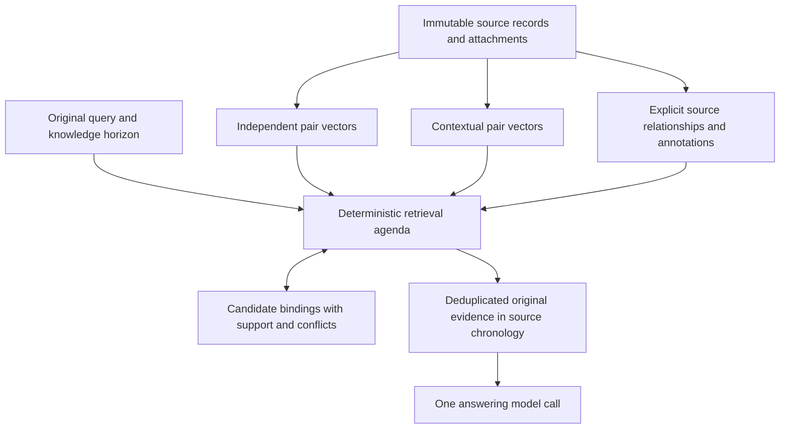

# Unified contextual memory: architecture design

**Status: accepted architecture; development authorized 2026-09-07. Experimental comparison not yet preregistered.**

**Date:** 2026-09-07. **Evidence snapshot:** `4c33842724c93e7389377a2622b2dd37518e98fe`.

**Scope:** one integrated architecture, one common evaluation, and a later separate preregistration. This document does not amend an earlier study or resume the paused full-LoCoMo run.

## 1. Decision proposed for review

Build on the current chronological relevance arm with a shared immutable source store, two semantic access views, a typed relationship ledger, and a deterministic retrieval controller. The controller can collect evidence through direct matching, contextual matching, explicit source connections, and candidate reference relationships. It preserves unresolved alternatives and supplies original evidence chronologically to one answering model call.

The central hypothesis is that **precise semantic access plus contextual evidence assembly can improve complete evidence delivery across semantic, temporal, and multi-hop questions under one architecture**. Correct reader answers remain necessary to establish end-to-end success. Better retrieval with unchanged or worse answers is a narrower finding, not architecture success. Establishing selective contextual retrieval also requires passing a preregistered whole-corpus-expansion guard; answer gains obtained through effectively exhaustive delivery receive a narrower interpretation.

This is a proposed combination, not an already validated stack. The most uncertain part is generating useful implicit relationships without inventing them. A controller or graph data structure cannot supply that missing capability by itself.

The proposed first version has four cooperating parts:

1. Keep the current independent pair-level semantic route and its chronological output.
2. Add an auxiliary contextual embedding view of the same source units, with late chunking as the preferred method to assess for feasibility.
3. Maintain explicit source connections and candidate inferred bindings in a common ledger, preserving the distinction between them.
4. Use a fixed-query agenda to retrieve supporting records and revisit unresolved bindings when new evidence arrives.

ColBERT, full assumption-based truth maintenance, complete interval algebra, and graph diffusion are not all requirements. They inform particular functions; optional alternatives are identified below. This design deliberately does not require a universal event partition before retrieval can work.

## 2. Research contract and scope

### 2.1 Determinism and the single answering call

Formation, indexing, parsing, linking, routing, retrieval, selection, and stopping make **zero generative model calls**. Frozen embedding encoders and parsers are permitted and must be declared; the architecture is deterministic memory processing with learned representations, not a claim that all its knowledge consists of hand-written rules.

There is one answering LLM call after retrieval and assembly finish. Its answer, reasoning, confidence, or clarification request cannot trigger another retrieval pass. Evaluation judges are separate measurement calls and cannot provide input to the memory mechanism. New caption generation, synthetic summaries, generated query decomposition, LLM entity resolution, and model-based retrieval adjudication are excluded.

Replay must bind source bytes, view construction, model artifacts, parsing rules, normalization, floating-point/vector representation, stable tie breaks, and configuration. Persisted vectors enable exact replay; a nominally fixed model or seed alone is insufficient. Report embedding and parsing work separately from generative call counts.

### 2.2 What is retained and what is proposed

| Retained foundation | Proposed addition or explicit change |
|---|---|
| Independent raw-cosine selection over source pairs | A separately calibrated contextual access view |
| Current direct threshold `cosine >= .48` | Relationship-based admissions with their own stated reasons |
| No additive recent-32 block | A finite agenda over retrieved records and candidate links |
| No character or item cap in relevance selection | Explicit fit failure if the assembled prompt cannot be served |
| Original evidence in stable chronological source order | Internal support, conflict, and ambiguity tracking |
| One reader call, serial orchestration, native thinking off | A declared source-fidelity repair shared by the experimental arms |

The `.48` threshold is a carried setting, not a universal relevance constant or a calibrated probability. It does not automatically transfer to another encoder, contextual view, token-matching score, or graph path.

The current natural-LoCoMo route has no active temporal anchor: the quoted subject/event parser was unsupported on all 1,986 examined question occurrences. Preserve this fact when naming the comparator. The proposed architecture must not be described as porting an already working natural anchor resolver.

### 2.3 One architecture and one experiment

The unit of the proposed treatment comparison is the **combined architecture**. A positive comparison supports that bundle. It does not identify which addition caused the gain. Selected ablations may later answer a specific unresolved attribution question; there is no requirement to create a separate design document or research arc for every internal function.

The repository's standing [scope rules](../../../AGENTS.md) require one new component per study and stop changes to carried subsystems. This proposal includes several cooperating changes, including source fidelity and indexing. Drafting is authorized by the user's current request; execution requires a future authorized preregistration that explicitly resolves this scope difference. Calling the entire bundle one component is not a substitute for that resolution. Existing locked registrations and artifacts remain unchanged.

## 3. Evidence that constrains the design

These results motivate choices; their populations, budgets, and endpoints are not interchangeable.

| Evidence | What it establishes | Consequence and boundary |
|---|---|---|
| [NF-005](../../components/biological_memory/nf_005/NF_005_REPORT.md): same 465 LongMemEval items and 32k budget; with turn packing fixed, own-turn ranking raised any exact evidence 361 to 461, with 100 gains and zero losses; all exact evidence 208 to 454. | Localizing the semantic candidate recovered substantial evidence on already observed data. | Preserve local access. This was availability characterization, not reader validation or proof that the smallest unit is always best. |
| [TC-004](../../components/tier_cost/TC_004_REPORT.md): splitting all already short LoCoMo pairs reduced complete evidence 749 to 687 at 16k, and 810 to 754 at 32k. | Full splitting regressed; the tested localization predictor did not reliably identify beneficial splits. | Keep pairs as the initial direct unit; do not assume finer is universally better. Multi-view union is untested. |
| [SUP-001](../../components/biological_memory/sup_001/SUP_001_REPORT.md): current-only delivery 0/64 to 64/64, exact histories 64/64; small live ablation 8/9 to 9/9. | Explicit version relationships can manage current and historical access while preserving immutable sources. | Reuse integrity and lineage concepts. Update metadata was supplied; natural-language contradiction detection and event binding were excluded. |
| [DMR-003 proposal](../../components/biological_memory/deterministic_retrieval/DMR_003_RETRIEVED_CONTEXT_RECURRENCE_IMPLEMENTATION_SPEC.md) and [readiness audit](../../components/biological_memory/deterministic_retrieval/DMR_002_EXECUTION_READINESS_AUDIT.md). | Stored encoding context and event completion were distinct architectural hypotheses, not executed successes or failures. | Revisit correct-context versus shuffled-context diagnostics. Stable DMR-001B/C formation did not establish reliable event identity. |
| [TC-012](../../components/tier_cost/TC_012_REPORT.md): growing-context ASPECT scored 720 versus CC80 771 at 16k and 787 versus 819 at 32k, on complete evidence. | The tested feedback rule drifted and regressed. | Preserve original-query access. Contextualizing source vectors before retrieval is a different intervention from updating the query using returned passages. |
| [DMR-004](../../components/biological_memory/dmr_004/DMR_004_REPORT.md) failed finite/open criteria; [NF-001](../../components/biological_memory/nf_001/NF_001_PART1_RECORD.md) made never stopping free on short streams. | Query grammar was unreliable for the tested completeness interpretation; the stopping instrument could not establish useful sufficiency. | Separate route recognition, search exhaustion, and answer sufficiency. No blanket rejection of deterministic control follows. |
| [DA post-mortem](../../audits/da_arc/DA_ARC_HH005_POST_MORTEM.md), [AV-MATRIX](../../components/aspect_v3/AV_MATRIX_FINDINGS.md), and [AV-READER-001](../../components/aspect_v3/AV_READER_001_FINDINGS.md). | DA eventually received live integration tests; adding old channels did not establish a reliable advantage. AV-MATRIX's common 842-item comparison at 32k gave 71.50% CC80, 71.50% CC80+ASPECT, and 72.09% with DA, with no significant contrast. | Reuse source-member materialization and provenance; do not equate availability with answers or nonsignificance with equivalence. |
| [Current 30-question probe](../../probes/locomo_timeline30/REPORT.md) and [miss audit](../../probes/locomo_timeline30/MISS_AUDIT_REPORT.md). | Broad sample: 13/20 correct and 16/20 complete annotations. Supplemental temporal sample: 5/10 correct and 10/10 complete annotations. Five excluded annotations across four questions fell below `.48`; one source caption was also omitted by formation. | These exposed questions are diagnostic development evidence. The four incomplete cases are not four demonstrated retrieval-caused answer failures; one was answered correctly and two references involved recommendations. No chronology causal claim follows. |

DA naming requires care. At git object `de20ac793decd66726412870c1215f8cb95c6467` (`resolve/pr91-merge`), `src/analysis/da001_linked_context.py` implements `EVENT` as same-session expansion and `TEMPORAL` as adjacent pairs. These are not inferred real-world event membership. Current [AV reconstruction code](../../../src/analysis/av_matrix.py) provides a route to inspect member identities without assuming the older branch's modules are deployed.

## 4. Proposed end-to-end flow



The diagram specifies responsibilities, not proof that the relationships can be inferred. In particular, contextual vector similarity can nominate a source passage without identifying which surrounding statement supplied its meaning.

### 4.1 Shared data contracts

| Object | Required content |
|---|---|
| Source record | Stable conversation/source ID, original text, speaker ID where supplied, source position, availability information, attachment links, and byte hash. Preserve supplied event-date text separately. |
| Retrieval unit | Ordered member source IDs and exact text. Initially retain current adjacent-pair units. Source members remain individually attributable even when their access unit is a pair. |
| Access view | Target unit IDs, context source IDs, token-span mapping where applicable, encoder/pooling/version hashes, knowledge horizon, and cached vector. |
| Relationship assertion | Endpoints, type, source-explicit or inferred status, named extraction rule, supporting source spans, and possible conflicts. |
| Binding candidate | Reference span, candidate antecedent IDs, admission reason, supporting/conflicting assertions, and unresolved or rejected-under-rule status. |
| Retrieval state | Original query, direct admissions, auxiliary admissions, agenda, processed operation keys, binding candidates, observed scores, and stop reason. |

Source session membership, speaker identity supplied by the corpus, and an attachment pointer are structural metadata. An inferred alias, pronoun referent, or same-event interpretation is not upgraded to structural fact because a parser or similarity score emitted it. A source's explicit claim is preserved as an attributed claim, including when another source contradicts it.

## 5. Access: small source units with contextual keys

### 5.1 Direct route

Compute the carried query-to-pair cosine independently. Admit all eligible pairs at or above `.48`, use stable source IDs for ties, and retain this result as an independently replayable set. Auxiliary routes cannot change its query vector, rescore it using accumulated retrieval, or silently remove its admissions.

This preserves the current arm's measurable contribution. Adding records can still distract the reader; preserving direct evidence guarantees set retention, not correctness monotonicity.

### 5.2 Auxiliary contextual route

The preferred feasibility candidate is late chunking. For a source context `W` and the token positions belonging to pair `i`:

`v(i, W) = Pool({ E(W)[t] : t belongs to i })`

Here `E(W)` is the embedding encoder's contextual token output. Pooling occurs over the target pair's tokens after contextual encoding. This cannot be reproduced by averaging cached pair vectors. Preserve both independent and contextual views rather than replacing all existing embeddings immediately.

The contextual route compares the original query with these contextual pair vectors. It nominates original pairs, not generated summaries. Context construction must be independent of evaluation labels and of the current query's retrieved results. The proposed default context is a source session where the encoder supports it; deterministic windows are required for overlength sessions. A guessed event partition is not required.

A contextual hit also schedules a support search within its recorded context `W`, even if a reference detector finds nothing. The target pair's original text is the fixed extractive cue; independent vectors for units in `W` supply candidate support scores. Admit support units only through the declared support threshold or an explicit structural dependency, not by rendering all of `W`. This is a hypothesis about localizing support, not a way to read causal attribution from a vector. Log `CONTEXT_SUPPORT_UNLOCALIZED` when no supporting unit qualifies. A reader fixture must test the case where the target matches only because its context names the organization: successful vector matching alone cannot pass that fixture if the organization source never reaches the reader.

The seed cannot serve as its own additional support. Exclude its source spans before qualifying support, and exclude a reference's own span from antecedent candidates. A unit with no additional source spans is never additional support. If a candidate overlaps the seed, only its additional spans may contribute to a support score; until an appropriate nonoverlapping view exists, that candidate is ineligible for semantic support. Explicit within-unit relationships can still be recorded, but they do not count as newly recovered evidence. Include a self-match-only negative fixture so `CONTEXT_SUPPORT_UNLOCALIZED` remains reachable.

**Open before implementation lock:** encoder and token-state access; context segmentation and overlap; token-offset integrity; pooling; handling overlength segments; append/recomputation policy; contextual threshold `tau_context`; and reproducibility of cached outputs. Prefer the existing encoder only if it can perform the required operation correctly. If another encoder is necessary, the bundle includes that change and does not support a pure pooling attribution.

Cosine values from independent and contextual views are not assumed calibrated. Do not combine their raw scores into an unexamined maximum or weighted sum. Preserve route-specific admission and overlap traces. A contextual hit is evidence of access, not proof of an antecedent relationship.

ColBERT-style token matching is a documented alternative for within-pair dilution, not part of the proposed first bundle. It needs different encoder/index machinery and does not by itself solve reference binding or temporal reasoning.

## 6. Relationships: explicit connections and candidate interpretations

### 6.1 Initial operator family

The first design should make a small, general operator family executable before considering elaborate graph objectives.

| Operator | Inputs and candidate-generation rule | Permitted conclusion |
|---|---|---|
| Source materialization | Follow supplied member and attachment IDs from an admitted unit. | Materialize that unit's complete source content and provenance. This does not recursively traverse a conversation. |
| Reply/reference traversal | From a detected unresolved reference, consider the supplied reply target under the declared direction and continuation rule. | Candidate contextual support. A genuine reply link is not unlimited query relevance; mere temporal adjacency is not an explicit reply. |
| Entity/reference candidates | Use stable speaker IDs, source names, explicit alias constructions, and declared deterministic mention rules. Preserve multiple compatible mentions. | Candidate identity/reference links. Shared names or a common speaker do not establish shared event identity. |
| Contextual reference search | For a detected unresolved reference, search eligible records using a frozen extractive source cue and/or the nominated pair's contextual view. Record the exact cue, search domain, and route score. | Candidate antecedents requiring support; semantic proximity is not resolution. |
| Explicit temporal/lineage constraints | Parse declared explicit date/order expressions or consume supplied version metadata. Associate each annotation with its source span. | Conditional temporal or version constraints under the named rule. Uncertain dates remain uncertain. |

For contextual reference search, the cue must be a reproducible extraction from a particular source span, not a generated paraphrase or the moving average of retrieved text. The original query remains fixed as a separate access and diagnostic signal. The proposed rule family is specified below; the parser/version, exact grammar inventory, and threshold values must be characterized and locked before implementation of the registered experiment.

“Accepted the offer” may be detected as a definite reference and may retrieve interview passages through semantic/contextual access. This design does not declare a universal `interview -> offer -> acceptance` rule to prove the relationship. The feasibility work must establish whether the chosen representations and rules propose the appropriate alternatives. Empty or unsupported output is observable behavior, not permission to add an LLM resolver.

### 6.2 Lightweight assumption ledger

Maintain a finite list of candidate bindings per reference, their supporting source spans, conflicts, and dependencies. Do not enumerate every combination of global possible worlds in the first version. The ledger borrows the dependency principle of assumption-based truth maintenance; it is not a claim to implement a complete ATMS.

Evidence can strengthen a candidate, contradict it under a declared rule, or leave it unresolved. Unknown is not false. A single candidate means “one found by this search,” not “the only possible real-world referent.” Do not convert cosine, temporal closeness, or a large score margin into certainty.

Hard rejection is reserved for an explicitly specified incompatibility supported by source information, such as supplied distinct identities where a rule requires the same identity. Parser outputs and normalized dates remain auditable and fallible. Contradictory source statements must be retained as conflicts; the mechanism cannot silently rewrite either one.

The ledger guides which records to collect. Its hypotheses do not enter the reader prompt as established facts or as a generated rationale. The initial reader interface presents original evidence with the common source metadata. Unsupported bindings and missing search coverage remain in diagnostic traces.

### 6.3 Proposed initial policy for review

This is the proposed operational structure, not a claim that its language rules already work. Numerical thresholds remain open; the operations must not be silently replaced by a different algorithm during implementation.

1. **Seed access.** Independent pair cosine supplies direct seeds at `.48`; contextual pair cosine supplies auxiliary seeds at `tau_context`. Preserve both sets and the view responsible for each hit.
2. **Context support.** Each contextual seed opens one search over its known `W` using the seed's unchanged pair text as an embedding cue. Qualifying support units reach `tau_support`; no whole-window admission is implied. Encoder windows are indexing domains, not retrieval-size allowances.
3. **Reference detection.** On admitted original source sentences, a fixed parser/rule inventory marks third-person pronouns, demonstrative references, and definite noun phrases as candidate unresolved references. Stable supplied speaker IDs ground first-person mentions where applicable. Marking a phrase does not establish its referent, semantic event type, or need for external context.
4. **Reference search.** The original sentence containing each marked span is its immutable embedding cue. Search all eligible source units in the same conversation, rather than only adjacent records, at a separate `tau_reference`. Record earlier sources as candidate antecedents and later sources as possible corroboration or clarification; source position alone cannot prove their event relationship. No cross-conversation identity merge is permitted. An explicit reply target can be nominated without the semantic threshold only when that marked reference triggered the operation.
5. **Constraints and continuation.** Add source-grounded identity, explicit reference, and temporal assertions where a declared rule recognizes them. Soft semantic scores nominate candidates; they do not reject competitors. Inspecting a candidate source is distinct from admitting it. Track evidence admission and continuation permission by route: a binding rejected before continuation supplies no continuation permission. Its source may still be admitted and expanded through an independent direct, contextual, or other supported route. A newly admitted source with such permission and its own unresolved reference schedules its own fixed-cue search. A reply chain continues only through such a newly detected reference, not merely because another reply link exists. Later conflict does not erase already delivered original evidence; it prevents further continuation through that rejected reason and remains in the trace.
6. **Ledger updates.** New supporting or conflicting source assertions update candidate status and can activate previously unprocessed dependency checks. They never create generated search text or repeated searches with a moving cue. If two candidates remain plausible, both supporting source sets are available to the reader. If no rule can distinguish them, record that result.

This policy makes contextual support search, reference search, and their expansion measurable separately. The ledger must affect permitted dependency checks or continuation on positive fixtures; if it merely records an unchanged union of search results, report it as inert and revise the proposed role before lock. No hard-coded company/job transition taxonomy is introduced to make the motivating example succeed.

### 6.4 Multi-hop behavior

Multi-hop retrieval is repeated application of these operators when a newly admitted record supplies a new reference or explicit relationship. Every admitted record must have a traceable path to a query seed or a named pending binding operation.

A strong explicit source link can admit a bridge whose own query cosine is below `.48`. This is a distinct eligibility reason. Even verified structural links require a declared traversal direction and continuation condition: blindly following replies can approach the entire conversation. Mandatory member/attachment materialization is separate from reply/reference traversal. Weak semantic association cannot automatically inherit structural-link eligibility; unrestricted similarity closure can also approach the whole corpus. Freeze the support/reference qualification rules before a run; do not select their parameters from gold evidence or reader misses.

No special mathematical diffusion algorithm is required initially. QAFD and query-aware spreading activation are alternative traversal mechanisms to consider only if the simpler agenda's deficiencies are identified. Their convergence or conditional recovery results do not prove evidence completeness here.

## 7. Controller, chronology, and stopping

### 7.1 Deterministic agenda

```text
freeze original query, configuration, and knowledge horizon
compute independent direct admissions
compute auxiliary contextual nominations under their own policy
materialize admitted source records and explicit structural dependencies
initialize candidate bindings and pending operations

while a permitted operation is pending:
    choose the next operation by the frozen stable ordering
    inspect its declared source/search domain
    add qualifying source records, assertions, or binding changes
    schedule only genuinely new dependent operations
    record every admission, rejection, conflict, and unsupported operation

deduplicate original evidence and render in stable source chronology
verify exact prompt fit and call the answering model once
```

The operation key includes its type, source/reference IDs, fixed cue/search domain, and any newly observed dependency assertions it consumes. Assertions accumulate monotonically as deduplicated tuples over finite source spans, candidate endpoints, and the frozen rule inventory. Candidate status is a deterministic function of those accumulated assertions; a changing status does not itself create a new assertion. A dependency version can advance only when a previously unseen assertion arrives. Rules cannot create an unbounded sequence of new labels, invented source spans, or global assumption combinations.

Each fixed-cue search runs once per fixed domain. Dependency checks consume each new finite assertion only as prescribed by the frozen rules. This finite progress argument is the termination contract; cyclic and multiply connected fixtures must verify its implementation. Finite records or an arbitrary version counter alone would not suffice. Termination still does not establish a complete answer.

The controller responds to both the question and encountered evidence. It does not need an exclusive semantic/temporal/multi-hop classification. A temporal question can require direct lookup, reference search, and lineage traversal in the same run. Unsupported query grammar must not suppress the independently functioning direct route.

### 7.2 Knowledge horizon and event time

Distinguish the time information was available from the time an event occurred. Every access view and retrieval operation obeys the declared knowledge horizon. Contextual vectors must not encode unavailable future source records.

For a retrospective question asked now, later testimony about an earlier event may be eligible. For “what was known as of date T,” information learned later is ineligible. These are different tasks. Do not infer a source-prefix cutoff merely because a question asks what happened before an event. The synthetic before-anchor improvement does not justify that cutoff on arbitrary natural conversations.

Render admitted records in stable source chronology, preserving source dates and explicit event-date text. Incomparable or ambiguous event times do not justify inventing a total event order. Proposed events, completed events, and quotations must remain distinguishable in the original source text; parsing their status is an annotation capability to test, not an assumed solved state extractor.

### 7.3 Relevance and operational limits

The proposed architecture uses eligibility and relevance policies, not a fixed character allowance or fixed number of selected records. It must report the resulting selection curves and expansion volume. A naturally exhausted agenda may still have selected most of the corpus; that is an important result, not automatically efficient retrieval.

Stop reasons distinguish `FRONTIER_EXHAUSTED`, `NO_FURTHER_QUALIFYING_EVIDENCE`, `UNSUPPORTED_OPERATION`, and `RESOURCE_FAILURE`. Unsupported operations can coexist with completion of other available routes. None means `ANSWER_COMPLETE`.

Verify exact serialized input plus the common reserved output allowance against the reader's context limit. Do not silently truncate, drop evidence, or introduce a hidden top-k cap to fit. Persist failures and retain them in the registered accounting. Any repair or overflow policy must be declared symmetrically before outcomes are inspected. Resource failure is not a missing query that can disappear from the denominator.

## 8. Worked behavior: job references and related cases

These are design fixtures, not experimental results or confirmation items.

| Situation | Expected architectural behavior |
|---|---|
| One named interview, then “I accepted the offer.” | Attempt to recover both source passages and retain the proposed connection with its evidence/search scope. One discovered antecedent is not proof that no alternative exists. |
| Two named interviews, then an unnamed acceptance | Retain both plausible antecedents and retrieve their supporting contexts. A recency advantage alone cannot establish the accepted company. |
| A later explicit statement names the accepted company | Revisit the binding using that source if it is within the knowledge horizon. Preserve the earlier statements and the later attribution. |
| The later clarification is outside an as-of snapshot | Exclude it from both contextual embeddings and retrieved evidence. Keep the ambiguity visible to the final reader through the eligible source records. |
| A proposal is followed by an actual acceptance | Preserve the words establishing proposed versus completed status. A status annotation cannot substitute for absent textual support. |
| A reaction says “that sign looks serious” | Follow an actual attachment/reply relationship where provided; otherwise propose contextual antecedents. A missing caption must be restored at source formation before retrieval can deliver it. |
| No compatible antecedent is found | Retain the original reference and log the unsuccessful search. Do not fabricate a bridge or obtain an additional model interpretation. |

The final reader can answer or ask for clarification in its single response. There is no automatic second pass based on that response.

### Concrete two-interview trace

Let `R1` contain “I interviewed at Northstar,” `R2` “I interviewed at Cedar,” and `R3` “I accepted the offer,” in that source order. The query asks which company made the accepted offer. These are source spans inside ordinary retrieval units.

1. Suppose `R3` is a contextual seed. Its view records the context used for encoding. Context support search examines that `W` with the unchanged `R3` text; it does not assume `R1` caused the vector match.
2. The definite phrase “the offer” triggers reference search using the unchanged sentence “I accepted the offer.” The search covers the eligible conversation. If `R1` and `R2` pass the frozen reference criterion, both are admitted as candidate support and the ledger records `R3 -> R1` and `R3 -> R2`. These are proposed bindings, not facts.
3. Their common speaker is compatible with both possibilities. Temporal proximity cannot reject `R1`. With no further distinguishing source, both remain unresolved; source materialization supplies both original histories to the reader.
4. If an eligible `R4` says “The offer I accepted was from Northstar,” the reference search can retrieve it as later corroboration if it qualifies. A declared explicit-name/reference rule may attach its source span as support for the Northstar candidate. It does not erase the Cedar interview or assume the statement uniquely resolves every other acceptance in the conversation. Dependency checks update; the original reference search is not rerun with a newly generated company query.
5. If the required antecedents or clarification do not pass their candidate criteria, the trace records that miss. If `R4` is outside the knowledge horizon, it contributes neither to contextual encoding nor to search. The fixture separately tests these cases.

The conditional admissions above describe required control flow, not measured embedding scores or a promise that the cue retrieves both interviews. Demonstrating candidate recovery with the actual encoder is an explicit feasibility obligation. The next search is triggered by a reference or new source assertion, not by a reader answer.

## 9. Common evaluation of the combined architecture

### 9.1 Two main arms and source parity

**C0: source-matched chronological relevance comparator.** Preserve the current independent pair route, `.48` selection, no recent-32 addition, no retrieval cap, chronological renderer, and carried reader interface. Build it in a separate frozen checkout. It receives the same source contract as C1 and imports no treatment linking/controller code.

**C1: the integrated architecture in this document.** The same independent route and source/reader interface, plus the frozen contextual view, relationship operators, ledger, and agenda.

The source-fidelity repair is common preprocessing: preserve already supplied caption text and its provenance, along with text, speaker, dates, and source IDs. Do not generate new captions. A benchmark-provided model caption is a supplied annotation, not verified image truth. The exact eligible metadata inventory and serialization require review and lock.

Recompute affected independent vectors consistently for both arms if their source text changes. Reproduce the historical caption-omitting configuration separately as an instrument check, not as the primary comparator. Consequently, the main contrast measures the bundle relative to a **source-matched version** of the chronological arm; it does not directly estimate gain over the historical 30-question results. Shared preprocessing changes require explicit registration scope too.

The current pair formation and direct selection are retained initially. Independent turn ranking, ColBERT, a stronger reader, a changed reasoning prompt, and an extra recent block are not silently added to C1.

### 9.2 Populations and generalization

Use one common battery spanning direct factual recall, temporal state/order, implicit references and ambiguity, multi-hop combinations, broad enumeration, and absent/unsupported information. These are reporting strata, not separate architectures or separate design documents.

All previously examined LoCoMo questions and synthetic D/E instances are development evidence. The repository has already used the full LoCoMo corpus across prior arcs; unsampled questions in the recent 30-item probe do not create a fresh program-level holdout. Historical LongMemEval exposure also requires an explicit inventory.

A future registration must identify a genuinely untouched evaluation population or label the result development validation. Corpus, split, sample size, category mapping, duplicate treatment, and selection rules are open. Novel surface names or generator seeds alone do not establish natural-language generalization. Select instances without control errors, treatment gains, or available gold-carrier ranks driving inclusion.

Include natural conversations for ecological relevance and controlled fixtures for mechanism identifiability. Keep their outcomes separate. Sufficient fixtures must cover the relationship patterns actually claimed, including competing referents, unrelated same-name entities, missing antecedents, retrospective testimony, long gaps, distracting nearby records, and cycles. A controlled success does not establish transfer by itself.

### 9.3 Endpoints and interpretation

| Measure | Role |
|---|---|
| Paired generated-answer correctness under a common frozen reader | Required end-to-end success endpoint. Freeze the practical/statistical bars and cross-task regression policy before measurement. |
| Any and complete annotated evidence delivery | Retrieval diagnosis, reported with annotation limitations and source fidelity. Not a substitute for answers. |
| Controlled-fixture evidence-set completion | Tests whether the mechanism can recover all deliberately supplied prerequisites, with validation that they were actually present. |
| Candidate-set coverage, retention of legitimate alternatives, irrelevant expansion, and erroneous rejection | Measure binding quality against a declared annotation basis. Forced promotion of a hypothesis to fact is an integrity violation; zero such violations is not evidence of accurate disambiguation. |
| Direct admissions retained, route gains/overlap, bridge paths, unsupported operations | Verify mechanism behavior and localize failures. Direct set retention is an invariant, not a reader guarantee. |
| Exact tokens, paired fraction of full source context, selected units, expansion depth, latency, and failures | Describe efficiency and operational behavior and enforce the preregistered nondegeneracy guard. Input cost is secondary to evidence quality; exhaustive delivery cannot silently count as selective retrieval. |

Recommendation questions whose reference requires outside knowledge must not be counted as ordinary recall failures merely because the exact recommended answer is absent from the source. Freeze handling of these question types, relative-date equivalence, planned-versus-completed events, and ambiguous references before examining evaluation answers. Annotation completeness is not automatically semantic sufficiency.

Use paired question outcomes with inference that accounts for conversation-level dependence and duplicates. Any repeated reader seeds are repeated measurements, not independent conversations. Report uncertainty and per-stratum gains/losses, not only a pooled percentage. The estimator, multiplicity policy, sample size, success bar, and weaker signal bar remain open until registration; do not select them from observed treatment outcomes.

Before lock, specify an achievable guard against whole-corpus or indiscriminate expansion. Use full-source selection as an offline positive control for detecting degeneracy; inspect paired selected/full source fractions and query-to-query selection variation rather than relying only on median tokens. The exact population rule and practical threshold remain open. This is an interpretation gate, not a cap that removes retrieved evidence, and it does not require a third main reader arm.

An offline improvement can justify further investigation but cannot be reported as a working answer architecture. Reader gains that fail the nondegeneracy guard are reported as improved answers with broader exposure, without claiming selective contextual retrieval. Passing reader and nondegeneracy criteria supports the bundle only on the tested population and reader condition; it does not establish the accuracy of every inferred relation, human-like memory, full generalization, or deployment readiness.

### 9.4 Reader, scoring, and execution integrity

Retain the carried HH-001 reader prompt and model/runtime identity as the starting proposal. Do not describe it as a verified Mem0-paper prompt. Freeze exact templates, generation settings, seed schedule, model/build hashes, and common context/output allocation in the registration.

Native thinking remains off for this first comparison and orchestration remains serial. Verify the actual template flag and short live behavior before a run; a reasoning-format option or an empty think suffix is insufficient. A reasoning/model upgrade is a later comparison, not a concurrent explanation for retrieval improvement.

Require identical-source and historical-prompt reproduction, leakage sentinels/import checks, positive and negative route fixtures, exact vector replay, and maximum-size serialization checks before inference. Persist request metadata and raw responses immediately. Uncertain retries, truncated outputs, and missing rows must follow a declared failure protocol, not disappear through automatic reruns.

Calibrate the scoring instrument, use the registered blind passes and adjudication policy, and score only final answer content outside reasoning blocks. The prior judge's first-versus-final verdict error must be covered by a regression fixture. Commit response completeness and score artifacts before opening outcome-linked mechanism diagnostics. During a long run, use persistent health/completion/failure hooks instead of model polling; do not activate hooks merely for this design task.

## 10. Development sequence within this one design

1. **Review and scope resolution.** Agree on the minimal bundle, the shared source repair, the comparator, and what claims the architecture should support. Resolve the open choices below without treating a diagram as implementation readiness.
2. **Authorized development and feasibility.** Once specifically authorized, freeze a development protocol within a version of this design, construct/replay the instrument on exposed data, verify token-level contextual encoding, and characterize relation proposals, ambiguity, expansion, and degenerate cases. This draft alone does not start that work.
3. **Experimental lock.** Freeze one separate preregistration with the complete combined configuration, control checkout, source/corpus identities, success and weaker-signal bars, runtime, scoring, and failure handling. Explicitly resolve the standing scope policy. Do not alter a locked prior study to accommodate the bundle.
4. **Preflight and integrated evaluation.** Complete required gates, execute the paired comparison, seal outcomes before mechanism interpretation, and report the combined result. Any later ablation needs its own explicit experimental scope; it can remain part of this architecture's design rather than becoming an unrelated research program.

Useful development diagnostics include true versus shuffled source context, independent versus contextual view hits, and correct versus deliberately broken structural links. They test whether the intended mechanism is active. They are not a license for exhaustive parameter fitting, nor a substitute for the main paired reader comparison.

### Preflight — NOT RUN

The authoritative [Preflight requirements](../../../PREFLIGHT.md) apply. No gate is represented as passed by this document. Required Part 1 deliverables are committed behavioral replays, name-to-behavior checks, full score/admission/expansion distributions, and real traces of degenerate, cyclic, absorbing, and near-full-context behavior. Their findings may revise this review draft before experimental lock.

| Check | Required future evidence; currently missing |
|---|---|
| PF1 Inputs exist | Counted, hashed source, view, encoder, parser, corpus/split, control, and measurement manifests; current source references do not establish the future instrument's completeness. |
| PF2 Mechanism identity | Demonstrate contextual token pooling, precise direct-route retention, source materialization, actual reference proposals, and non-inert ledger/controller behavior on committed inputs. |
| PF3 Gate ordering | Executable negative tests and git/run-header evidence that authorization, source/vector checks, preflight, calibration, raw completeness, scoring, and diagnostic opening occur in order. |
| PF4 Achievable thresholds | Check support/reference operating points, practical/statistical bars, weaker-signal bars, and the degeneracy guard against reachable outcomes and positive/negative controls before lock. |
| PF5 Stable keys | Content-bound identities for units, contexts, operations, and assertions; no UUID/path/time-dependent comparison keys. |
| PF6 Reproduction anchor | Reproduce historical selected IDs and prompt digests, then prove the separately frozen source-matched C0's behavior. Matching counts alone is insufficient. |
| PF7 Absorbing-state proof | Finite-progress checks plus real intended-length traces showing the controller does not lock onto unchanged context, cycle, or exhaust through indiscriminate expansion. |
| PF8 Adequate ablation length | Establish what short fixtures cannot detect, including distant references, append-induced contextual changes, late ambiguity, and long reply chains; test at the intended corpus scale. |
| PF9 Surrogate audit | Demonstrate that contextual hits can lack delivered support, annotations can differ from sufficiency, zero forced bindings can be inert, and exhausted traversal can select everything. Record accepted residuals for each gate and metric. |
| PF10 Live evaluation | Execute the registered paired single-reader comparison to assess answer value; availability alone cannot supply the architecture verdict. |

## 11. Decisions still open for review and lock

| Decision | Proposed direction | What must be settled |
|---|---|---|
| Source schema | Text plus supplied captions/metadata with explicit provenance, common to both arms | Eligible fields, identity mapping, renderer, horizon semantics, and affected vector recapture |
| Direct unit | Retain existing pairs and `.48` policy | Exact frozen control revision and source-matched implementation |
| Contextual view | Late chunking over reproducible source context | Encoder compatibility, context construction, pooling, caching, append behavior, threshold |
| Reference candidates | Proposed policy in section 6.3: fixed source cues, contextual-window support, conversation-wide reference candidates | Frozen parser/rule inventory, thresholds, compatibility checks, and demonstrated candidate coverage |
| Constraint/ledger rules | Local alternative bindings with source-supported support/conflict | Rule inventory, rejection semantics, update ordering, and bounded representation of alternatives |
| Controller | Fixed query, deterministic agenda over monotone finite assertions | Stable ordering, finite rule domains, scheduling dependencies, and termination proof/fixtures |
| Retrieval completion | Route exhaustion and explicit failure states | Observable stop definitions; no semantic-completeness label |
| Evaluation | Two source-matched arms and one cross-task battery | Exposure inventory, corpus/split, sample size, strata, endpoints, nondegeneracy guard, statistical and practical bars |
| Reader and scoring | Same HH-001/native-off serial reader in both arms | Exact runtime, common fit allowance, scorer calibration and ambiguity/failure policies |

These open entries are substantive research and instrument choices. They must be resolved before execution; they are not to be filled silently during a run. If contextual access or candidate binding cannot pass feasibility, revise the integrated proposal transparently rather than quietly shipping a different bundle under this document's name.

## 12. External foundations and their limits

- [Late Chunking (2024; revised 2025)](https://arxiv.org/abs/2409.04701): contextualize token representations before pooling target spans. It requires encoder/token-state access and does not identify explicit antecedent edges or guarantee gains in this corpus.
- [ColBERTv2 (NAACL 2022)](https://arxiv.org/abs/2112.01488): token-level late interaction offers an alternative to a single mixed-topic vector. It is not an event resolver and is outside the initial proposed bundle.
- [Deterministic Coreference (2013)](https://aclanthology.org/J13-4004/): precision-ordered rules for mentions and entities. The authors report substantial event-coreference limitations. Use as a source of candidate-generation principles, not proof that offer/interview identity is solved.
- [SUTime (2012)](https://aclanthology.org/L12-1122/) and [Allen's interval algebra (1983)](https://cse.unl.edu/~choueiry/Documents/Allen-CACM1983.pdf): date-expression normalization and reasoning over explicit temporal constraints. Neither supplies general event identity. Arbitrary interval consistency is not guaranteed by local propagation.
- [Assumption-based truth maintenance (1986)](https://doi.org/10.1016/0004-3702%2886%2990080-9): provenance and alternative assumption sets. It supplies dependency management, not missing language understanding, evidence, or calibrated probabilities; global alternatives can grow combinatorially.
- [QAFD (2026)](https://arxiv.org/html/2605.18775v1) and [query-aware spreading activation (2026)](https://arxiv.org/abs/2606.30133): query-aware numerical traversal ideas. Their published pipelines include generative extraction or query/seed processing. Only appropriate mathematical components are candidates for reuse; query-alignment assumptions can exclude necessary low-similarity bridges.

The external papers support component mechanisms. Their combination here is our architectural hypothesis and has not been evaluated by those papers or by the repository's earlier studies.

## 13. Authorized development protocol (2026-09-07)

After accepting this document, the user instructed: "You can begin end to end implementation." This authorizes development of the combined architecture and its instrument, including the source-matched control. The bundled scope is intentional, rather than a silent exception inferred from a component name. A separate experimental preregistration will restate that scope and freeze the outcome comparison after Part 1. Earlier study registrations are unchanged.

Work on `study/unified-contextual-memory`, based on `71ce3cbb`. Development code/artifacts live under `experiments/unified_contextual_memory`; reusable mechanism code may live under `src/unified_memory`. Keep this document as the single architecture/development design. The following phase precedes selecting experimental thresholds or opening new reader outcomes.

### Phase A: encoder and source feasibility

- Inventory and hash the installed Qwen3-Embedding-0.6B Q8_0 model, llama-cpp-python/runtime libraries, source corpus, prior vector manifests, and historical selected prompts. Use the existing local encoder first. No model or corpus download is assumed necessary.
- In an isolated process, expose unpooled token vectors with `LLAMA_POOLING_TYPE_NONE`, one text per call, seed 5005, GPU offload, context/batch/microbatch 8192, and eight CPU threads. Pass `truncate=False`; enforce exact token fit before every call. These are technical probe settings, not retrieval budgets or confirmed settings for the final run.
- Use fixed illustrative texts about Northstar/Cedar interviews and an unrelated cooking context. Measure independent native pooling versus the corresponding unpooled last-token vector; repeated token-vector identity; contextual target pooling (last token and mean); token/source-offset integrity; sensitivity to preceding context; and invariance to unavailable following context for the causal encoder. Persist all numeric outputs and runtime identities before interpretation. This checks representation mechanics, not reader accuracy or benchmark evidence recovery.
- A causal model cannot encode following records into earlier token states. Record that limitation explicitly. A last-token contextual representation may preserve the model's native pooling better than mean pooling, but neither is selected merely by whichever gives the desired job answer. Select an implementation only after its pooling semantics and replay behavior are demonstrated; document the decision before corpus capture.
- Independently inspect the LoCoMo source schema without using answers/evidence labels in mechanism code. Preserve original text/speaker/date/dialogue IDs and supplied `blip_caption` text with explicit annotation provenance. Images remain references; no caption-generation calls. Enumerate other metadata and state its treatment. Shared preprocessing must not import the treatment retrieval engine.
- Replay the historical 1,986 selected ID/payload groups before new selection measurements. Previously examined LoCoMo is development data. No fresh confirmation claim or test population is selected by this phase.

### Phase B: development instrument and operating points

Implement the policy in section 6.3 with immutable identities, exact knowledge horizons, source-matched independent control, finite monotone assertions, and transparent per-route traces. Verify self-support rejection, actual support delivery, ambiguous/missing references, forbidden future context, rejected-path continuation, cyclic references, and near-full-context degenerate controls before benchmark interpretation.

Auxiliary thresholds must be calibrated separately from `.48`. First record query/context, source-cue/support, and reference-cue candidate score distributions on the exposed development surface, including mismatched-conversation controls, without consulting gold support or generated answers. Commit those measurements and the chosen operating rule before any paired reader run. Do not perform a sweep over reader accuracy. The actual thresholds and their selection justification belong in the same document and final registration once observed scale is known.

Part 1 ends with a committed manifest/report of the actual implementation, configuration, limitations, gates, and remaining decisions. A failed feasibility check triggers a documented repair or an explicit revision of the bundle, not an unreported substitute. Until the separate experimental registration and preflight exist, the live comparison must fail closed. Reader settings, source parity, single-call boundaries, scoring order, and quiet long-run hooks remain as specified above.

Phase A diagnostic follow-up: raw token-state results at `3352b079` show exact native-last pooling and solo replay, but the target changes when a following sentence is appended. Before attributing this to attention, repeat the same probe with an identical trailing newline in the short and extended contexts and record token IDs through the target. This separates changed byte-pair token boundaries from genuine following-context influence. Preserve both attempts; no retrieval threshold or answer outcome is involved.

Phase A implementation decision: use contextual **last-token** pooling, preserving the encoder's native pooling semantics, rather than choosing mean pooling by downstream outcomes. The equal-token-prefix follow-up has cosine .999719 but is not bit-identical after an append; no prefix-invariance or future-attention attribution is claimed. Cache complete context text and target membership and reconstruct views from only horizon-eligible sources. Session contexts that exceed 8,192 tokens split greedily at whole-pair boundaries without overlap; an oversized single pair fails instead of truncating. This is an explicit initial indexing policy, not a retrieval budget. Store old independent vectors with their historical provenance and capture changed source text/new cues separately. Runtime differences cannot be hidden as historical byte reproduction.

Phase B operating-rule lock, before inspecting the auxiliary score distributions: use the empirical 99th percentile (`numpy.quantile(..., .99, method='higher')`) of mismatched-conversation scores for each auxiliary route separately. Context calibration uses historical question vectors against contextual units in other conversations; support calibration uses independent source-unit vectors against other-conversation units; reference calibration uses extractive reference-cue vectors against other-conversation units. Exclude same-conversation pairs from these calibration populations. Record all counts, quantile curves, per-conversation summaries, and input/output hashes. This controls an empirical mismatch tail, not a calibrated probability of relevance or proof of transfer. Apply the resulting three thresholds once to characterize selection/expansion; no reader/gold optimization is authorized by this rule. A degeneracy failure is reported before deciding a documented repair, rather than silently retuning the percentile.

The initial reference parser is spaCy 3.8.14 with en_core_web_sm 3.8.0, exact original sentence cues, third-person/demonstrative words listed in code and definite noun chunks. CPU parsing uses up to eight independent workers; inference and vector captures remain solo. Inferred candidates remain unresolved. The ledger accepts explicit source-grounded exclusions through its typed interface; the LoCoMo adapter supplies none, so the first natural-data implementation makes no automatic contradiction, event-identity, or temporal-state resolution claim. Grounded-constraint behavior is tested separately with explicit metadata fixtures. These limitations must remain visible in Part 1 and the final configuration.
