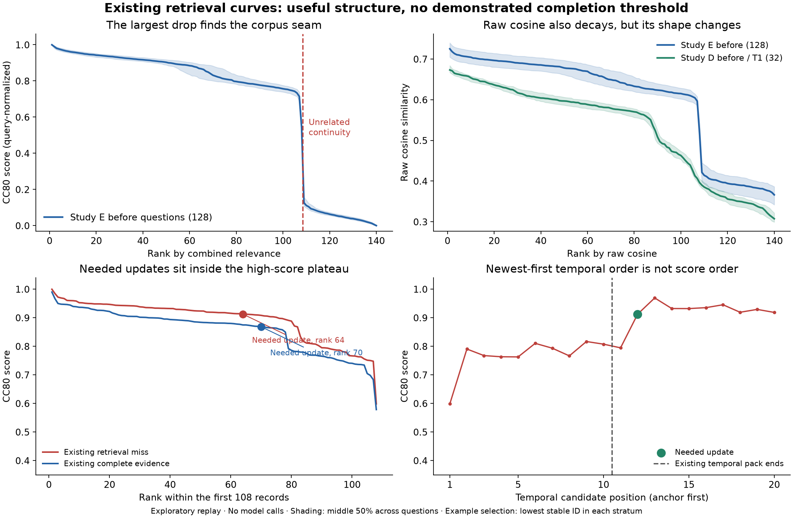

# Existing-run retrieval score curves

2026-09-06. Design anchor **573e07aa**. Exploratory clues only: no threshold fitted or adopted, no model or embedding calls, no previous result changed.

The curves contain meaningful decay and sharp gaps. In Study E, however, the largest gap identifies the synthetic corpus's topic boundary rather than a compact sufficient evidence set. Required state updates sit inside a broad high-score band. This supports investigating arithmetic filtering while leaving retrieval completion unresolved; it does not reject the entire threshold family.

## Population and replay

All192 Study E confirmation questions and224 existing Study D queries were inspected separately. Study E's128 before questions are the primary descriptive population; Study D's32 T1 before questions are the closest historical slice. Other types remain in the artifacts and are not pooled into the before comparison. Study D's rank inventory includes queries beyond the scored before/latest subset;224 is not its reader-score denominator.

Study E raw cosine, BM25 and CC80 scores were reconstructed using only persisted exact vectors and the frozen control ranker. All192 full ranked identity sequences matched their original sealed traces. All224 Study D preserved score arrays matched source identities and frozen tie-break ordering. The replay used four workers, one numerical thread each, and took1.66seconds; zero model or embedding calls. Curves and replay gate were committed at **1532cd5e** before required-source annotations.

CC80 combines independently min-max-normalized cosine and BM25 at80:20 within each query. It is not a probability of relevance or sufficiency, and its absolute scale depends on the candidate population. Raw cosine and BM25 were therefore examined separately. Scores along newest-first temporal order are also preserved: all160 E before/absent temporal sequences were nonmonotone in CC80. Sorted correlation decay must not be attributed to chronological order.

## What the curves show

**1. A real, very sharp corpus boundary.** On all128 E before questions, the largest adjacent CC80 drop is between rank108 and109. The top108 are exactly the pre-continuity source turns1–108; the bottom32 are unrelated gardening-club continuity records. The median drop is0.4061 on the combined score scale. Stopping at that gap retains complete evidence128/128, including all19 current misses—but retains108 records every time. This is a broad relevance filter under this generator, not evidence that it knows when a particular answer is established.

**2. The answer-bearing updates score highly.** Across the19 existing retrieval misses, the required state-setting update ranks32–66 (median52). Its score is88.40–94.50% of that query's highest CC80 score (median90.25%). The median adjacent drop immediately after the required update is only0.001423. Those records are inside the high-score band, rather than isolated at its end. Across all128 before questions, state-setting updates range from rank1 to87 and85.82–100% of the highest score. These retrospective ranges are not proposed thresholds.

**3. A gap can also separate different evidence roles.** After excluding the32 continuity records, the largest CC80 gap leaves a median107 records (range49–107). Every state-setting target survives, but the essential review anchor falls below the boundary on all128 questions. Restricting to the before-eligible pool similarly retains a median71 candidates and drops the anchor; the pool's median size is72. This is an illustrative unprotected-prefix counterfactual. **The current temporal route already protects the anchor**, so these zero-completeness counts are not a regression of the current implementation or grounds to discard thresholding. They show why one generic correlation cutoff should not govern every evidence role.

**4. Curve shape changes across runs.** On Study D's32 T1 before questions, the full-store largest CC80 gap lies after87–107 records (median89.5), with complete evidence22/32. In E the same arithmetic selects108 every time and retains128/128. Across all224 D query types, the selected size ranges1–139 (median2), retaining complete evidence111/192 answerable queries; absence has no positive-evidence denominator. Query type matters greatly. These are descriptive existing-run contrasts, not cross-corpus transfer validation.

**5. Component choice matters.** Using raw cosine's largest full-store gap on E selects107 or108 records and retains complete evidence82/128, despite retaining all128 state-setting targets. The anchor can fall on the other side of the gap. A shape in the combined score should not be treated as an embedding-only property. Neither calculation rescored reader answers.

## Illustrative largest-gap check

The boundary was fixed arithmetically as the largest adjacent score drop, with earliest tie breaking, before annotation. No labels enter that choice. Flat and singleton curves are undefined. This is one diagnostic example, not a claim to exhaust possible knees, ratios, slopes or completion criteria.

| Existing population / candidate view | Median records retained | Complete required evidence |
|---|---:|---:|
| E before, full store, CC80 | 108 | 128/128 |
| E before, exclude continuity, CC80 | 107 | 0/128; anchor omitted, all targets retained |
| E before, eligible pool, CC80 | 71 | 0/128; anchor omitted, all targets retained |
| E before, full store, raw cosine | 108 | 82/128; all targets retained |
| D before/T1, full store, CC80 | 89.5 | 22/32 |

The nineteen existing misses are packing misses, not lack of candidate availability. A threshold permissive enough to preserve the high-score band could recover their updates, but these observations do not establish how compact or safe such a rule would be on a different distribution. No resource-limit exercise or threshold optimization was performed.

## Working interpretation

There is arithmetic structure worth studying: strong separation of broadly related from unrelated material, and weaker separations among types of related records. What is not established is that score decay identifies the evidence needed to finish an answer. The current evidence suggests treating anchors and qualifying records as explicit obligations while investigating whether score shape can delimit the surrounding candidate pool. That is a hypothesis, not a newly implemented policy.

Selection of figure examples uses the lowest stable query identity in the existing complete/miss strata, not visual appeal. The raw-cosine panel compares before questions only. Shading is the middle50% across questions, not a confidence interval. Labels and source roles were inspected retrospectively after curve extraction; these exposed data cannot serve as a fresh confirmation set. No deployment, reader benefit or universal-cutoff claim follows.

Artifacts: [raw curves](artifacts/curves.json), [replay gate](artifacts/replay_gate.json), [all diagnostic rows](artifacts/diagnostic_rows.json), [stratified summaries](artifacts/summary.json), [state-setting target positions](artifacts/target_diagnostic.json), [PDF figure](score_curves.pdf). Preflight fixtures exercise separated/flat/singleton curves and nonmonotone temporal order; full replay and exact source checks passed. Prior Study D/E scores and mechanisms remain immutable.
