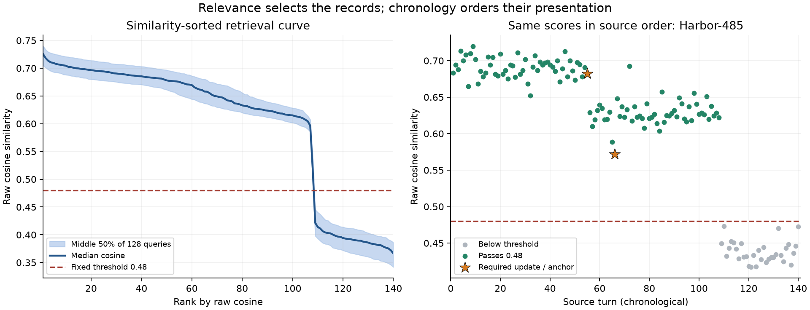

# Uncapped relevance timeline at cosine0.48

Exploratory, September6,2026. Selection plan1676445b; mechanism27e2cce7; blindgate d275e9ce. Reader plan860ea072; wrapperb81fd591; inputgate f375d8e1; calibration53c26cb1. No prior study scores or deployed defaults changed.

**With chronology held fixed, fresh reader correctness on the same12 before questions is8/12 for budgeted C1 and11/12 for the uncapped relevance timeline.** See paired counts below. This is a small exposed-data probe, not a confirmation or a population accuracy estimate.

## What changed

The prototype admits every full source record with raw query cosine>=0.48, adds the existing identified question anchor if it falls below that threshold, deduplicates and presents oldest to newest. It has no8k temporal allocation,32k retrieval cap, top-N bound or additive last32 block. All140 source records are eligible for the similarity check; even a recent continuity record can enter if it passes. No source compression/extraction or new embeddings are used.

The0.48 value comes from the legacy K-route default in episodic/_config.py and its >= comparison in _context.py. It is not a CC80 score or a probability, and was not shown universally optimal by that default. A horizontal cutoff is an initial relevance boundary, not an adaptive gradient stopping algorithm. Chronological order is presentation order, separate from ranking by similarity.

## Offline evidence and output size

| E before queries,128 | Complete required evidence | Records retained | Median serialized chars |
|---|---:|---|---:|
| Prior C1,chronological/no recency |109/128|40–41|31,346|
| Pure cosine>=.48 |111/128|107–113|84,560|
| Cosine>=.48 plus anchor |128/128|108–113|84,627|

The anchored candidate recovers all19 previous availability misses with zero required-evidence losses on128before questions. The pure threshold loses17 question anchors; relative to C1 its15gains/13losses yield only+2. Every needed state-setting update passes; the protected anchor supplies a different evidence role. Latest-question evidence reaches32/32 versus21/32C1. The32absence questions have no positive-evidence completeness metric.

Selection retains most of the108 broadly related source records, usually rejects the32 unrelated gardening continuity records, and admits0–5 of those continuity records on before queries (median0). This is substantial expansion from40–41 records, not a compact-completion result. Output size is measured, never used to stop selection.

The same pure threshold on the earlier Study D before slice gives11/32complete, retaining88–104 records (median95). D did not receive the anchor-union adaptation in this diagnostic; do not compare its pure score with E anchored as a controlled transfer effect. This cautions against treating.48 alone as a universal sufficiency certificate.

Left: median and middle50% of raw-cosine ranked curves over128Ebefore questions. Right: previously audited Harbor-485 in source order. This selection supplies the previously missing update while preserving chronological presentation.

## Fresh reader comparison

| Questions | Budgeted chronological C1 | Uncapped chronological relevance |
|---|---:|---:|
| primary | 8/12 | 11/12 |
| latest | 2/2 | 2/2 |
| absent | 2/2 | 2/2 |

primary: 4 gains,1 losses in paired final correctness.

latest: 0 gains,0 losses in paired final correctness.

absent: 0 gains,0 losses in paired final correctness.

Native thinking is off in both arms, seed5005, serial, cachefalse, same pinned model/template/sampling, one replicate. Both arms use4096 output tokens rather than the earlier16384 reservation; this common reduction was locked before measurement. All full timelines plus output allowance fit32768context (maximum input18,208tokens), so no input was trimmed and no context-size change was needed. Two arithmetic calibration responses were identical; all32measurement calls completed.

| Arm | Median input tokens | Measurement seconds for16calls |
|---|---:|---:|
| BASELINE | 6,794 | 38.37 |
| RELEVANCE | 18,012 | 108.30 |

## Every sampled answer

| Question | Expected | Budgeted chronological | Relevance chronological |
|---|---|---|---|
| What was the delivery location for "Harbor-292" immediately before "Harbor-292 review"? | hangar | hangar ✓ | hangar ✓ |
| What was the delivery location for "Harbor-485" immediately before "Harbor-485 review"? | office | workshop ✗ | office ✓ |
| What was the delivery location for "Harbor-113" immediately before "Harbor-113 review"? | studio | studio ✓ | studio ✓ |
| What was the delivery location for "Orchard-186" immediately before "Orchard-186 review"? | hangar | hangar ✓ | The hangar ✓ |
| What was the delivery location for "Orchard-657" immediately before "Orchard-657 review"? | hangar | hangar ✓ | The delivery location for "Orchard-657" immediately before the "Orchard-657 review" (which occurred at turn 59) was the **hangar**.  This is determined by looking at the last location change before turn 59. - Turn 52: "The delivery location for 'Orchard-657' is now the hangar." - Turns 53-58: Reviews or other notes that explicitly state they "made no change to its delivery location" or "say nothing about its delivery location". - Turn 59: "The meeting 'Orchard-657 review' took place..."  Therefore, the location remained the hangar from turn 52 until the review at turn 59.  Answer: hangar ✓ |
| What was the delivery location for "Orchard-219" immediately before "Orchard-219 review"? | hangar | hangar ✓ | The hangar ✓ |
| What was the delivery location for "Meadow-637" immediately before "Meadow-637 review"? | depot | depot ✓ | studio ✗ |
| What was the delivery location for "Meadow-792" immediately before "Meadow-792 review"? | annex | annex ✓ | annex ✓ |
| What was the delivery location for "Meadow-228" immediately before "Meadow-228 review"? | warehouse | studio ✗ | The delivery location for "Meadow-228" immediately before the "Meadow-228 review" (which occurred at turn 71) was the **warehouse**.  This is based on the sequence of location changes: - Turn 60: Location changed to **warehouse**. - Turns 61-70: Reviews with **no change** to the delivery location. - Turn 71: "Meadow-228 review" meeting took place.  Therefore, the location was the warehouse.  **warehouse** ✓ |
| What was the delivery location for "Riverside-324" immediately before "Riverside-324 review"? | annex | office ✗ | annex ✓ |
| What was the delivery location for "Riverside-481" immediately before "Riverside-481 review"? | laboratory | hangar ✗ | The delivery location for "Riverside-481" immediately before the "Riverside-481 review" (which occurred at turn 55) was the **warehouse**. This was set at turn 60? No, wait.  Let's trace back from turn 55. - Turn 54: Proposal to move to warehouse. **Not accepted.** No change. - Turn 53: Review. No change. - Turn 52: Review. No change. - Turn 51: Review. No change. - Turn 50: Review. No change. - Turn 49: Review. No change. - Turn 48: Review. No change. - Turn 47: Review. No change. - Turn 46: Review. No change. - Turn 45: "The delivery location for 'Riverside-481' is now the **laboratory**. This replaces its previous location."  So, at turn 45, the location became the laboratory. Turns 46-54 were reviews or non-accepted proposals, meaning the location remained the **laboratory**. Turn 55 is the review meeting.  Therefore, the location immediately before the review was the laboratory.  Answer: laboratory ✓ |
| What was the delivery location for "Riverside-755" immediately before "Riverside-755 review"? | annex | annex ✓ | annex ✓ |
| What is the latest delivery location for "Cedar-443"? | warehouse | warehouse ✓ | warehouse ✓ |
| What is the latest delivery location for "Cedar-967"? | office | office ✓ | office ✓ |
| What was the delivery location for "Summit-519" immediately before "Summit-519 review"? | I don't know | I don't know. ✓ | I don't know. ✓ |
| What was the delivery location for "Summit-899" immediately before "Summit-899 review"? | I don't know | I don't know. ✓ | I don't know. ✓ |

## Interpretation and next use

This concrete prototype tests the user’s hypothesis: a semantically selected timeline can admit updates excluded by hard packing caps and then be read chronologically. The relevance filter and the larger delivered set are part of the same intervention; this probe does not isolate a special curve effect from having more evidence. The threshold was not tuned on these outcomes. Anchor protection is explicit and must remain in descriptions of the result.

Keep chronological presentation in further experimental work. Use this fixed0.48+anchor implementation as the starting candidate, preserving its uncapped output rather than silently reintroducing a character quota. A broader reader comparison is needed before adoption. Any later adaptive curve boundary should be evaluated for evidence loss, unrelated admissions and reader correctness across distributions; this small synthetic corpus is not an oracle for choosing it.

## Integrity and limitations

Original192chronological payloads reproduce exactly; score arrays bind to prior verified vectors/ranking traces. Boundary,empty/full and anchor-exception fixtures pass. Label-free timelines/gate were committed before required-source annotation. Reader failed-input-gate fault injection occurred before any reader calls and made zero network requests. Input and duplicate calibration gates were committed before measurement; raw responses before blind canonical scores; scores before aggregation. No uncaptured/uncertain retry, no cap escalation, no reasoning-based scoring.

The16question sample is the previous fixed content-id sample, not selected for this treatment’s outcomes. It is exposed, synthetic, one seed and includes only four latest/absence guards.29answers score mechanically; three explanatory responses were adjudicated by a single agent under prior authorization. One starts with a wrong value, explicitly retracts it and concludes laboratory correctly. The final-answer rule scores that correction, not every claim in its prose. No human or independent-rater audit is claimed. This is an exploratory reader result without a new WORKS disposition or production adoption.

All four previous retrieval misses become correct answers. The new regression is Meadow-637: correct depot becomes studio despite the depot update at76, the not-yet-effective workshop announcement at82, and review anchor85 all being present. Studio was the immediately preceding effective value at75 (and occurred earlier too). This identifies a complete-evidence reader error; the short emitted answer does not identify why it happened. Added-history interference is a hypothesis, not an isolated cause.

Raw calls committed d4d4905f; mechanical scores58084300; blind agent decisionsb9a9eebb; all resolved scores7cec805 before aggregate. Owned server13964 was verified and stopped. No jobs remain.

Artifacts: relevance_artifacts/blind.json,gate.json,diagnostic_rows.json,summary.json; reader/schedule.json,complete.json,scores.json,scores_resolved.json,scoring_gate_resolved.json,result.json,runtime_summary.json. Figure provenance is in figure_manifest.json. Source labels are measurement-only; the selector accepts ids,turns,scores and existing anchors.
