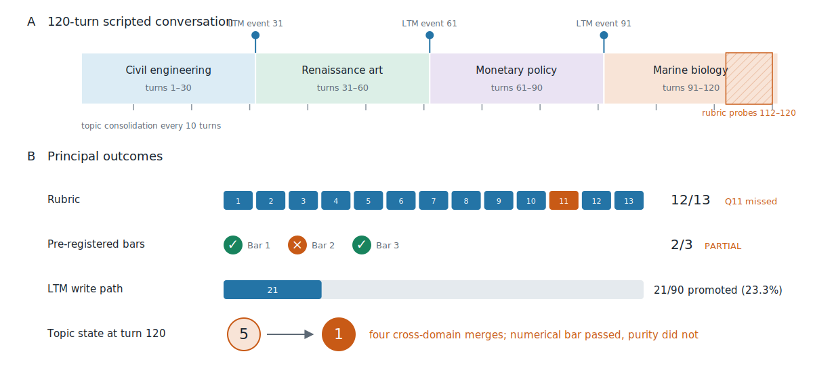
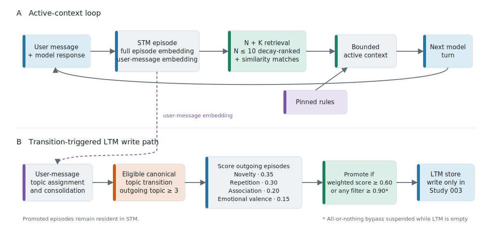
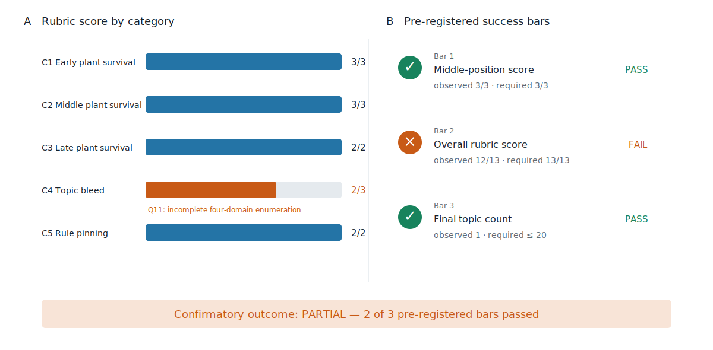
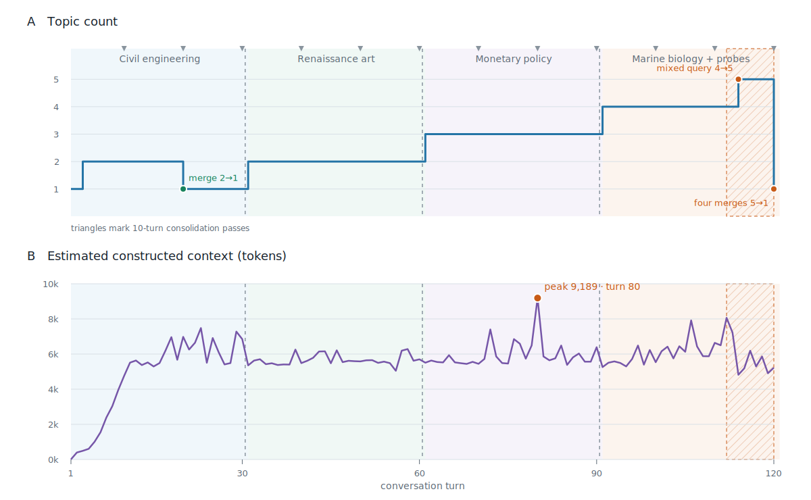
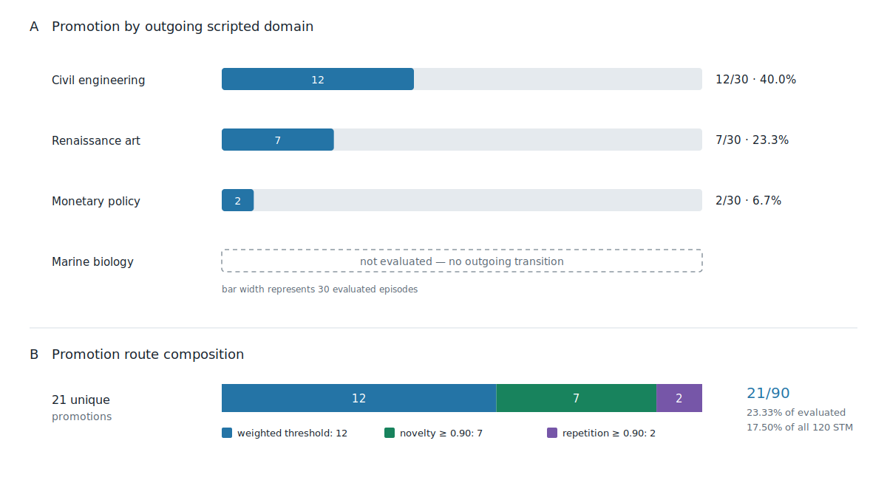
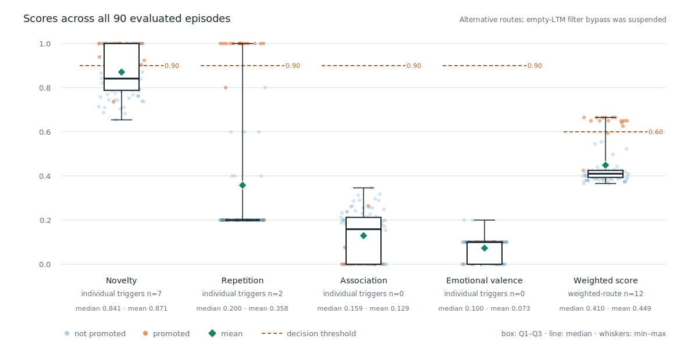

# Selective Short-Term-to-Long-Term Promotion in an Iterative Memory Architecture for Long-Context Language Models

**Author and affiliation:** Idris Applied AI Research<br>
**Study date:** July 2026<br>
**Report date:** July 19, 2026<br>
**Status:** Complete — **PARTIAL** (2 of 3 pre-registered success bars passed)<br>
**Pre-registration commit:** `4c9003176d0130540ae1f257d5140c9daa919415`<br>
**Accepted run:** `study_003_full_002`<br>
**Document status:** Canonical Study 003 research paper; not peer reviewed

## Abstract

Long context windows do not by themselves guarantee reliable access to information throughout a prompt, motivating systems that construct bounded working contexts from external memory. Study 003 evaluated an iterative conversational-memory architecture that combines episodic short-term memory (STM), similarity-based retrieval, topic consolidation, persistent rule storage, and a new observational STM-to-long-term-memory (LTM) promotion write path. The pre-registered confirmatory design comprised one 120-turn condition over four scripted domains, with planted facts at early, middle, and late positions and a 13-point recall-and-behavior rubric. The LTM path was write-only and therefore could not affect response generation.

The accepted run, `study_003_full_002`, was conducted after a model/runtime deviation, three remediation ablations, four documented protocol amendments, and the invalidation—before scoring—of the first full run. The accepted run scored **12.0/13.0** and retained perfect middle-position recall (**3.0/3.0**). It passed the pre-registered consolidation bar with **1 final topic**, although inspection showed that a turn-120 comprehensive query induced cross-domain over-merging. Thus, the study outcome was **PARTIAL: 2 of 3 success bars passed**. The LTM mechanism emitted the expected events at turns **31, 61, and 91**, evaluated **90** outgoing STM episodes, and promoted **21** episodes (**23.33% of evaluated episodes**) into **21 unique LTM rows**. The single rubric failure was a broad four-domain enumeration query that omitted Renaissance-art and monetary-policy evidence. These results show that the tested architecture preserved targeted recall while exposing two unresolved problems: coverage for broad multi-domain retrieval and consolidation purity. Because this was a single accepted run with one rater and no active LTM read path, the findings are descriptive and do not establish causal superiority or generalization.

**Keywords:** long-context language models; retrieval-augmented generation; episodic memory; memory consolidation; short-term memory; long-term memory; conversational agents; topic clustering



*Figure 1. Study design and principal outcome flow. The hatched interval marks rubric probes, during which promotion event emission was disabled. The terminal topic count met the numerical success bar, but the five-to-one collapse reflected cross-domain over-consolidation rather than ideal clustering.*

## 1. Introduction

Increasing a language model's nominal context capacity does not ensure that it will use all positions equally well. Controlled experiments have found position-dependent degradation when relevant evidence appears in the middle of long inputs [1]. Retrieval-augmented generation addresses a related systems problem by coupling generation to explicit non-parametric memory rather than requiring every potentially useful item to remain in the active prompt [2]. Later agent architectures have extended this pattern to persistent experience streams, reflection, and tiered context management [3, 4].

The `contextDecayWindow` research program studies a bounded-context alternative for long conversations. Rather than append the entire conversation on every turn, the iterative condition stores user–assistant episodes, retrieves a limited recency set plus semantically related episodes, pins persistent rules, and clusters episodes by topic. [Study 002](../study_002/README.md) reported perfect 13.0/13.0 performance for this iterative condition and perfect middle-position recall, but its topic-consolidation mechanism failed: 52 topics remained after 120 turns. Study 003 was designed to preserve that recall performance, repair consolidation and rule detection, and introduce a selective STM-to-LTM write path.

The term *consolidation* is used here as an engineering analogy. In neuroscience, memory consolidation refers to time-dependent transformations in memory representations and their supporting biological systems [5]. The present system performs deterministic storage, embedding comparison, and database writes; it neither models biological circuits nor tests a neuroscientific theory. Likewise, its novelty, repetition, association, and emotional-valence filters are software heuristics inspired by broad memory findings, not biologically faithful mechanisms.

This paper distinguishes the locked pre-registered design from later deviations and amendments, reports the invalid first full run separately from the accepted retry, and separates empirical measurements from interpretation.

## 2. Related Work and Background

### 2.1 Long-context position effects

Liu et al. demonstrated that long-context model performance can vary substantially with the position of relevant information, with frequent degradation for evidence in the middle of the input [1]. Study 003 does not replicate that multi-model benchmark. Instead, it inherits a single scripted long-conversation test from Study 002 and asks whether bounded episodic retrieval preserves planted facts across early, middle, and late positions.

### 2.2 Retrieval-augmented and computational memory systems

Retrieval-augmented generation combines parametric generation with an explicit non-parametric store selected at inference time [2]. Related agent systems use persistent natural-language memories, importance and relevance scoring, reflection, or explicit movement between memory tiers. Generative Agents stores an experience stream and retrieves memories using recency, importance, and relevance before synthesizing higher-level reflections [3]. MemGPT frames context management as movement between limited active context and larger external storage [4]. Study 003 shares the general premise that external memory can support bounded active context, but its LTM contribution is narrower: promoted episodes are written and analyzed but never retrieved during the study.

### 2.3 Episodic memory, consolidation, and encoding signals

Biological memory research distinguishes transient representations from longer-term transformations supported by reactivation and integration with existing knowledge [5]. Novelty has been associated with long-term encoding [6], repeated retrieval can strengthen later retention [7], and emotional arousal can modulate consolidation [8]. These findings motivate the *names* and qualitative ordering of the four software filters. They do not validate the implemented cosine distances, retrieval-count normalization, model-generated emotional scores, filter weights, or thresholds. The association score is likewise an embedding-based engineering proxy for similarity to the existing LTM centroid, not a measurement of biological associative memory.

## 3. Research Questions and Pre-Registered Criteria

The locked [pre-registration](pre_registration.md) specified one primary and one observational question:

1. **Primary:** Do the Study 002 architectural fixes maintain Study 002 Condition C's 13.0/13.0 rubric score without regression?
2. **Structural:** Does the revised consolidation mechanism reduce the final topic count to 20 or fewer?
3. **Observational:** How does the four-filter STM-to-LTM promotion mechanism behave during a 120-turn, four-domain conversation?

The LTM mechanism had no pre-registered pass/fail criterion. Three bars determined the confirmatory outcome:

| Bar | Pre-registered criterion | Study 002 reference |
|---|---|---:|
| 1 | Study 003 Category 2 score ≥ 3.0/3.0 | 3.0/3.0 |
| 2 | Study 003 overall score ≥ 13.0/13.0 | 13.0/13.0 |
| 3 | Final topic count at turn 120 ≤ 20 | 52 topics |

All three bars were required for a `VALIDATED` outcome. Any mixed result was to be reported without altering the criteria. Observational LTM measures included promotion volume by topic, score distributions, trigger frequencies, LTM size, the STM-to-LTM ratio, promotion timing, and merge-relabel guard activity.

## 4. Methods

### 4.1 Design

Study 003 used only **Condition C—Iterative Construction v3**. Full-context and summarization-compaction conditions were retired after Studies 001 and 002; therefore, this study was a historical non-regression comparison against Study 002 Condition C, not a concurrent randomized comparison.

The fixed 120-turn script comprised four abrupt 30-turn domain phases:

| Turns | Scripted domain |
|---:|---|
| 1–30 | Civil engineering |
| 31–60 | Renaissance art history |
| 61–90 | Monetary policy |
| 91–120 | Marine biology, followed by late probes within the final phase |

Facts were planted at early (turns 3–5), middle (turns 55–60), and late (turns 100–110) positions. Rubric probes occurred at turns 112–120. The script and authoritative [13-question rubric](../study_002/rubric_filled.md) were reused without modification to reduce script and scoring-instrument variance.

### 4.2 Model and runtime

The pre-registration and accepted execution differed in quantization, serving mode, and context capacity.

| Parameter | Pre-registered | Accepted run |
|---|---|---|
| Inference model | Qwen3.6 27B Q6_K | Qwen3.6 27B NVFP4 |
| Runtime | In-process llama.cpp provider | Local llama.cpp HTTP server |
| Context capacity | 147,000 tokens | 262,144 tokens |
| Hardware | NVIDIA RTX 5090, 32 GB VRAM | NVIDIA RTX 5090, 32 GB VRAM |
| Embedding model | Qwen3-Embedding-0.6B | Qwen3-Embedding-0.6B Q8_0 GGUF |
| Embedding dimensionality | 1,024 | 1,024 |
| Response budget | 1,024 tokens | 1,024 tokens |

The [NVFP4 server deviation](protocol_deviation_nvfp4_server.md) was recorded before the full run. The server used llama.cpp's `/completion` endpoint, suppressed visible reasoning output, and prefilled a closed thinking block. Consequently, Study 003 is conditional on the NVFP4 server configuration and is not a same-quantization replication of Study 002.

### 4.3 Iterative memory architecture

Each completed turn produced an STM episode containing the user message, assistant response, full episode embedding, topic assignment, retrieval metadata, and decay state. Context construction used the Study 002 N+K pattern: a soft cap of 10 decay-ranked episodes (N), supplemented by similarity-selected episodes (K), plus pinned rules. Promoted episodes remained resident in STM.

Following Amendment 002, two representations served different roles:

- The **user-message embedding** determined topic assignment and topic centroids, reducing sensitivity to variation in assistant response length and style.
- The **user–assistant episode embedding** remained the representation for retrieval, LTM scoring, and storage.

Topic consolidation ran every 10 episodes. Topic assignment and consolidation both used a cosine-similarity threshold of 0.45 in the accepted run. Consolidation mappings were propagated in memory so transition checks compared canonical topic identities after merges.

### 4.4 STM-to-LTM trigger and promotion filters

Under the amended implementation, promotion evaluation occurred after the first episode of a new canonical topic had been stored. The outgoing topic had to contain at least three episodes, and an STM episode already present in LTM could not be promoted again. Promotion was eligible through turn 111; the pre-declared rubric-probe block at turns 112–120 retained normal retrieval, storage, topic assignment, and consolidation but could not emit LTM promotion events.

At each eligible transition, all not-yet-promoted episodes in the outgoing canonical topic were scored against one frozen pre-batch LTM centroid:

| Filter | Operational definition | Weight |
|---|---|---:|
| Novelty | `1 − cosine_similarity(episode, LTM centroid)` | 0.35 |
| Repetition | Topic-window retrieval count normalized to 1.0 at five retrievals | 0.30 |
| Association | `cosine_similarity(episode, LTM centroid)` | 0.20 |
| Emotional valence | Separate model score for emotionally significant content | 0.15 |

The standard score was

\[
S = 0.35N + 0.30R + 0.20A + 0.15E.
\]

An episode was promoted when \(S \ge 0.60\). When LTM was non-empty, any individual filter score ≥ 0.90 could instead trigger an all-or-nothing promotion. For the empty initial LTM, novelty defaulted to 1.0 and association to 0.0, but the all-or-nothing bypass was suspended for all filters; first-batch episodes therefore had to satisfy the weighted threshold. The LTM centroid remained fixed within a transition batch and was recomputed only after the batch was written.

These filters should be interpreted strictly as engineered selection features. Although novelty, repeated retrieval, integration with prior representations, and emotional arousal have counterparts in memory research [5–8], the implementation does not instantiate or test their biological mechanisms.



*Figure 2. Iterative memory architecture used in Study 003. The active-context loop influenced model responses; the transition-triggered LTM path did not, because LTM was write-only. Promoted episodes also remained resident in STM.*

### 4.5 Procedure

The study proceeded in the following order:

1. Lock the pre-registration at commit `4c9003176d0130540ae1f257d5140c9daa919415`.
2. Record the model/runtime deviation before the full run.
3. Conduct mandatory 35-turn ablations and apply documented remediation amendments.
4. Authorize the full run only after all 11 pre-run checks passed.
5. Run `study_003_full_001`; preserve but invalidate it before rubric scoring because it violated the transition and rule-persistence requirements.
6. Record Amendment 004 and verify the affected behaviors with unit tests.
7. Run the accepted retry, `study_003_full_002`, for all 120 turns.
8. Score the locked rubric before conducting observational LTM analysis.

### 4.6 Evaluation and statistical treatment

One rater manually scored 13 questions across five categories: early recall, middle recall, late recall, topic bleed, and rule pinning. Each question contributed 0 or 1 point except where the locked rubric allowed half credit. Category and total scores were compared directly with the pre-registered thresholds.

LTM and consolidation results were summarized with counts, proportions, minima, maxima, means, and medians. No hypothesis test, confidence interval, effect-size estimate, multiple-comparison procedure, or statistical-significance claim was pre-registered or computed. Because the accepted sample was one run, all reported LTM statistics are descriptive.

## 5. Protocol Deviations and Amendments

The chronology below is essential: none of the amendments was part of the original locked design, and none is presented as pre-registered.

| Record | Timing and trigger | Change or disposition |
|---|---|---|
| [Runtime deviation](protocol_deviation_nvfp4_server.md) | Before the full run; Q6_K artifact unavailable | Replaced Q6_K in-process inference with Qwen3.6 27B NVFP4 via a local llama.cpp server; context capacity changed to 262,144 tokens. |
| [Amendment 001](protocol_amendment_001_ablation_remediation.md) | After an ablation produced 29 events and 53 LTM rows from 35 STM episodes | Made promotion idempotent with unique episode IDs and lowered topic assignment from 0.50 to 0.45. Re-verification remained NO-GO. |
| [Amendment 002](protocol_amendment_002_topic_representation.md) | After continued within-domain fragmentation | Changed topic assignment and centroids to user-message embeddings; retained full episode embeddings for retrieval and LTM. |
| [Amendment 003](protocol_amendment_003_transition_residence.md) | After a transient two-episode cluster emitted a zero-promotion event | Required at least three episodes in an outgoing canonical topic before event emission. |
| [Ablation GO](ablation/ablation_report.md) | After `ablation_35_amendment_003` | All 11 checks passed; one turn-31 event evaluated 30 episodes and promoted 15; full run authorized. |
| [Full Run 001 deviation](protocol_deviation_full_001.md) | After `study_003_full_001` completed 120 turns | Six events occurred at turns 31, 61, 91, 112, 114, and 118; zero rules persisted. The run was preserved unchanged, excluded from scoring and confirmatory analysis, and treated only as a diagnostic artifact. |
| [Amendment 004](protocol_amendment_004_probe_boundary_and_rule_fallback.md) | After invalid Full Run 001 and before any scoring | Excluded turns 112–120 from event emission and added a conservative fallback for explicit conversation-wide rules when model metadata was absent. |

The four filter definitions, filter weights, weighted and all-or-nothing thresholds, script, rubric, and 120-turn scope were not changed by these amendments.

## 6. Results

### 6.1 Accepted-run integrity

| Measure | Accepted result |
|---|---:|
| Run ID | `study_003_full_002` |
| Completed turns | 120 |
| STM episodes | 120 |
| Persisted rules | 1 |
| Consolidation passes | 12 (every 10 turns) |
| Promotion events | 3 |
| Promotion event turns | 31, 61, 91 |
| Peak constructed context | 9,189 estimated tokens at turn 80 |
| Final topic count | 1 |

The accepted run met the amended integrity requirements: all turns completed, the opening persistent rule was stored, and promotion occurred only at the three scripted domain boundaries.

### 6.2 Rubric outcomes

| Category | Questions | Score |
|---|---|---:|
| Category 1 — Early plant survival | Q1–Q3 | 3.0/3.0 |
| Category 2 — Middle plant survival | Q4–Q6 | 3.0/3.0 |
| Category 3 — Late plant survival | Q7–Q8 | 2.0/2.0 |
| Category 4 — Topic bleed | Q9–Q11 | 2.0/3.0 |
| Category 5 — Rule pinning | Q12–Q13 | 2.0/2.0 |
| **Overall** | **Q1–Q13** | **12.0/13.0** |

Q1–Q10 and Q12–Q13 received full credit. Q11 received 0.0 because the turn-120 response omitted the required Renaissance-art and monetary-policy values and entities and incorrectly stated that those domains had not been discussed. The full item-level rationale is preserved in the [accepted score sheet](runs/run_001/condition_c/rubric/scores.md).

### 6.3 Pre-registered success bars

| Bar | Criterion | Observed | Outcome |
|---|---|---:|---|
| 1 | Category 2 ≥ 3.0/3.0 | 3.0/3.0 | Pass |
| 2 | Overall ≥ 13.0/13.0 | 12.0/13.0 | **Fail** |
| 3 | Final topic count ≤ 20 | 1 | Pass |

**Confirmatory outcome: PARTIAL (2 of 3 bars passed).**



*Figure 3. Confirmatory outcomes. Q11 was the only failed rubric item, reducing Category 4 to 2/3 and the overall score to 12/13. The middle-position and topic-count bars passed; the overall-score bar did not.*

### 6.4 Topic consolidation

Topic growth followed the four scripted domains until the final probe:

| Checkpoint | Topics | Observation |
|---:|---:|---|
| Turn 30 | 1 | Civil-engineering phase consolidated |
| Turn 60 | 2 | Two scripted domains represented |
| Turn 90 | 3 | Three scripted domains represented |
| Turn 110 | 4 | Four scripted domains represented |
| Before turn-120 consolidation | 5 | Comprehensive four-domain query formed an additional mixed topic |
| After turn-120 consolidation | 1 | Four merges at similarities 0.45–0.54 collapsed the topic set |

The final count of 1 passes the upper-bound fragmentation criterion. It is not evidence of ideal clustering: the comprehensive turn-120 query caused cross-domain over-consolidation. The accepted [threshold decision](decisions/DECISION_consolidation_threshold_study003.md) therefore retains 0.45 only as the value tested in Study 003, not as a general default.



*Figure 4. Topic and constructed-context trajectories. Phase shading follows the scripted domains; hatching marks turns 112–120. The final topic-count value conceals a turn-120 cross-domain collapse. Estimated context remained far below the model's nominal 262,144-token capacity and peaked at 9,189 tokens on turn 80.*

### 6.5 LTM promotion outcomes

| Outgoing scripted domain | Event turn | Evaluated | Promoted | Promotion rate | Route composition |
|---|---:|---:|---:|---:|---|
| Civil engineering | 31 | 30 | 12 | 40.00% | 12 weighted-threshold |
| Renaissance art | 61 | 30 | 7 | 23.33% | 7 all-or-nothing |
| Monetary policy | 91 | 30 | 2 | 6.67% | 2 all-or-nothing |
| Marine biology | None | 0 | 0 | N/A | Structurally unevaluated: no outgoing transition |
| **Total** | — | **90** | **21** | **23.33%** | **12 weighted; 9 all-or-nothing** |

The LTM store ended with **21 rows representing 21 distinct STM episode IDs** and no duplicate promoted IDs. Promotion therefore selected **21/90 evaluated episodes (23.33%)** and **21/120 total STM episodes (17.50%)**.



*Figure 5. Observed LTM promotion volume and route composition. Each evaluated transition contributed 30 candidate episodes. Marine biology had no outgoing transition and therefore no promotion denominator. Rates are descriptive observations from one run, not estimates of domain effects.*

| Trigger route or filter | Count | Share |
|---|---:|---:|
| Weighted-threshold promotions | 12 | 57.14% of promotions |
| All-or-nothing promotions | 9 | 42.86% of promotions |
| Novelty triggers | 7 | 77.78% of all-or-nothing promotions |
| Repetition triggers | 2 | 22.22% of all-or-nothing promotions |
| Association triggers | 0 | 0.00% of all-or-nothing promotions |
| Emotional-valence triggers | 0 | 0.00% of all-or-nothing promotions |

All 90 evaluated episodes contributed to the score summaries:

| Filter or score | Minimum | Maximum | Mean | Median |
|---|---:|---:|---:|---:|
| Novelty | 0.6541 | 1.0000 | 0.8707 | 0.8414 |
| Repetition | 0.2000 | 1.0000 | 0.3578 | 0.2000 |
| Association | 0.0000 | 0.3459 | 0.1293 | 0.1586 |
| Emotional valence | 0.0000 | 0.2000 | 0.0728 | 0.1000 |
| Weighted score | 0.3655 | 0.6650 | 0.4489 | 0.4100 |



*Figure 6. Filter-score distributions across all 90 evaluated episodes. Boxes span the first to third quartiles, center lines show medians, whiskers show observed minima and maxima, and diamonds show means. Orange and blue points distinguish promoted and non-promoted episodes. Thresholds represent alternative promotion routes: the 0.90 individual-filter bypass was suspended for the empty-LTM first batch, while later all-or-nothing promotions can have weighted scores below 0.60.*

No merge-relabel guard event was logged, and no promotion event occurred during turns 112–120. The complete descriptive record appears in the [LTM observational analysis](runs/run_001/ltm_analysis/analysis_report.md).

## 7. Discussion

### 7.1 Findings

First, the accepted architecture retained targeted planted facts at all three tested positions. Category 2, the primary middle-position non-regression measure, remained 3.0/3.0. The study nevertheless failed the overall non-regression bar because the broad Q11 enumeration omitted two of four domains. This pattern separates successful targeted retrieval from incomplete global coverage.

Second, consolidation corrected Study 002's fragmentation under the pre-registered count criterion: the final topic count fell from the historical 52-topic reference to 1. Yet the trajectory shows that the terminal value is misleading in isolation. Four coherent domain topics were present through turn 110; the turn-120 mixed-domain probe then connected and collapsed them. Study 003 therefore passed the count bar while revealing a cluster-purity failure mode that the bar did not measure.

Third, the amended LTM write path behaved deterministically at the intended boundaries. It generated exactly three events, maintained episode uniqueness, and selected 21 of 90 evaluated episodes. The trigger mix differed by batch: the empty-LTM civil-engineering batch used only the weighted route, whereas all nine later promotions used all-or-nothing novelty or repetition triggers. Marine biology was not evaluated because the design lacked an end-of-session flush.

### 7.2 Interpretation

The turn-120 retrieval record provides a plausible explanation for the Q11 failure: its 11 retrieved episodes came from turns 1–9, 114, and 119, with no Renaissance-art or monetary-policy planting episode in the constructed context. This is consistent with a retrieval-coverage limitation for broad, multi-domain requests. It does not establish that retrieval configuration alone caused the generated omission; only one stochastic run was observed, and no component ablation was performed on the accepted run.

The decreasing promotion rates—40.00%, 23.33%, and 6.67%—co-occurred with a changing LTM centroid and route availability. Mean novelty declined across the three batches from 1.0000 to 0.8424 to 0.7697, while mean association rose from 0.0000 to 0.1576 to 0.2303. Those measurements describe how the fixed rules interacted with the accumulating store. They do not show that novelty, repetition, or association is intrinsically more useful for language-model memory, nor do they validate the pre-registered weights.

Because LTM was write-only, no rubric outcome can be attributed to LTM. Study 003 characterizes which episodes the mechanism would make available to a future read path; it does not test whether reading those episodes improves recall. A subsequent study should evaluate domain-balanced retrieval, deduplicate overlapping STM and LTM results, retain trigger provenance, and add an end-of-session evaluation for the final active topic.

## 8. Threats to Validity and Limitations

- **Single run and stochastic inference.** One accepted run cannot estimate run-to-run variance. A one-question difference from Study 002 may not be stable.
- **Single rater.** No second rater or inter-rater agreement estimate was used. Although the rubric was locked, manual scoring remains a source of measurement error.
- **Historical comparison.** Study 002 supplied the baseline; no concurrent control condition was run in Study 003.
- **Model/runtime deviation.** NVFP4 server inference replaced the pre-registered Q6_K in-process configuration, limiting comparability with Study 002 and binding the result to this runtime.
- **Scripted domain boundaries.** Four clean 30-turn domains and planted facts simplify transition detection and do not represent blended natural conversations.
- **Post-registration amendments.** Four amendments were necessary. They were documented before the accepted retry, but the accepted system is not identical to the originally pre-registered implementation.
- **Invalid-run exposure.** Full Run 001 revealed late-probe and rule-detection failures before Amendment 004. The retry was therefore informed by diagnostic behavior from the same script, although no rubric scoring of the invalid run occurred.
- **Count without purity.** The final-topic success bar detects fragmentation but not cross-domain collapse; the count of 1 masks over-merging.
- **Write-only LTM.** LTM did not participate in context construction, so the study cannot claim a recall benefit from promotion.
- **Unevaluated final domain.** Marine biology had no outgoing transition and contributed no scored promotion batch.
- **Filter construct validity.** Cosine distance, retrieval count, centroid similarity, and an LLM score are weak engineering proxies for novelty, repetition, association, and emotional significance. Neuroscience citations motivate analogy only.
- **No inferential statistics.** The descriptive dataset does not support population-level or causal claims.

## 9. Reproducibility and Artifact Availability

The repository contains the locked protocol, amendments, accepted lightweight artifacts, scoring record, and observational analysis. The accepted run is archived under `runs/run_001/`, while its original execution identifier remains `study_003_full_002`. Heavy local databases, prompt snapshots, and raw JSONL logs are excluded from version control under repository artifact policy; canonical summary metrics and LTM CSVs are retained.

Reproduction requires the model server and embedding artifact described in the runtime deviation. The canonical launcher is `scripts/run_study_003_full.py`, and the study definition is `experiments/study_003/script.json`. A fresh run must use an unused run ID; replaying the accepted ID would not constitute an independent replication.

The six SVG figures are generated directly from the accepted CSV metrics and rubric score sheet using only the Python standard library:

```powershell
.\.venv\Scripts\python.exe scripts\generate_study_003_figures.py
.\.venv\Scripts\python.exe scripts\generate_study_003_figures.py --check
```

The second command fails if a committed figure differs from a fresh generation. Figure definitions, source-artifact mappings, and interpretive cautions are documented in [`figures/README.md`](figures/README.md).

No source code or data artifact is altered by this paper. The pre-registration, amendments, deviations, scores, and analysis reports remain the authoritative audit trail for chronology and measurements.

## 10. Conclusion

Study 003 concluded **PARTIAL**, passing **2 of 3** pre-registered success bars. The accepted 120-turn run preserved perfect middle-position recall at **3.0/3.0**, scored **12.0/13.0** overall, and ended with **1 topic**, thereby passing the topic-count bar but exposing a terminal cross-domain over-merge. Its observational LTM write path emitted the intended events at turns **31, 61, and 91**, evaluated **90** episodes, and promoted **21 unique episodes (23.33%)**.

The evidence supports a narrow conclusion: under one scripted run, the amended iterative architecture retained targeted recall and produced an analyzable, selective LTM store. It does not support claims that LTM improved recall, that the promotion filters are biologically valid, or that the architecture generalizes. Broad multi-domain retrieval coverage, topic purity, LTM read-path utility, end-of-session promotion, replication, and independent scoring remain open requirements.

## References

1. N. F. Liu, K. Lin, J. Hewitt, A. Paranjape, M. Bevilacqua, F. Petroni, and P. Liang, “Lost in the Middle: How Language Models Use Long Contexts,” *Transactions of the Association for Computational Linguistics*, vol. 12, pp. 157–173, 2024. [doi:10.1162/tacl_a_00638](https://doi.org/10.1162/tacl_a_00638)
2. P. Lewis, E. Perez, A. Piktus, F. Petroni, V. Karpukhin, N. Goyal, H. Küttler, M. Lewis, W.-t. Yih, T. Rocktäschel, S. Riedel, and D. Kiela, “Retrieval-Augmented Generation for Knowledge-Intensive NLP Tasks,” in *Advances in Neural Information Processing Systems 33*, 2020. [NeurIPS proceedings](https://proceedings.neurips.cc/paper/2020/hash/6b493230205f780e1bc26945df7481e5-Abstract.html)
3. J. S. Park, J. C. O'Brien, C. J. Cai, M. R. Morris, P. Liang, and M. S. Bernstein, “Generative Agents: Interactive Simulacra of Human Behavior,” in *Proceedings of the 36th Annual ACM Symposium on User Interface Software and Technology*, Article 2, 22 pages, 2023. [doi:10.1145/3586183.3606763](https://doi.org/10.1145/3586183.3606763)
4. C. Packer, S. Wooders, K. Lin, V. Fang, S. G. Patil, I. Stoica, and J. E. Gonzalez, “MemGPT: Towards LLMs as Operating Systems,” arXiv:2310.08560, 2023. [doi:10.48550/arXiv.2310.08560](https://doi.org/10.48550/arXiv.2310.08560)
5. Y. Dudai, A. Karni, and J. Born, “The Consolidation and Transformation of Memory,” *Neuron*, vol. 88, no. 1, pp. 20–32, 2015. [doi:10.1016/j.neuron.2015.09.004](https://doi.org/10.1016/j.neuron.2015.09.004)
6. E. Tulving and N. Kroll, “Novelty Assessment in the Brain and Long-Term Memory Encoding,” *Psychonomic Bulletin & Review*, vol. 2, no. 3, pp. 387–390, 1995. [doi:10.3758/BF03210977](https://doi.org/10.3758/BF03210977)
7. J. D. Karpicke and H. L. Roediger III, “The Critical Importance of Retrieval for Learning,” *Science*, vol. 319, no. 5865, pp. 966–968, 2008. [doi:10.1126/science.1152408](https://doi.org/10.1126/science.1152408)
8. J. L. McGaugh, “The Amygdala Modulates the Consolidation of Memories of Emotionally Arousing Experiences,” *Annual Review of Neuroscience*, vol. 27, pp. 1–28, 2004. [doi:10.1146/annurev.neuro.27.070203.144157](https://doi.org/10.1146/annurev.neuro.27.070203.144157)

## Appendix A. Artifact Map

| Artifact | Repository-relative location |
|---|---|
| Pre-registration | [pre_registration.md](pre_registration.md) |
| Sprint plan | [study_003_sprint_plan.md](../../sprint-specs/study_003_sprint_plan.md) |
| Study script | [script.json](script.json) |
| Study 002 baseline paper | [Study 002 README](../study_002/README.md) |
| Authoritative rubric | [Study 002 rubric](../study_002/rubric_filled.md) |
| Runtime deviation | [protocol_deviation_nvfp4_server.md](protocol_deviation_nvfp4_server.md) |
| Invalid Full Run 001 disposition | [protocol_deviation_full_001.md](protocol_deviation_full_001.md) |
| Amendments 001–004 | [Amendment 001](protocol_amendment_001_ablation_remediation.md), [002](protocol_amendment_002_topic_representation.md), [003](protocol_amendment_003_transition_residence.md), [004](protocol_amendment_004_probe_boundary_and_rule_fallback.md) |
| Ablation report and GO decision | [ablation_report.md](ablation/ablation_report.md) |
| Accepted run notes | [run_notes.md](runs/run_001/run_notes.md) |
| Accepted rubric responses | [responses.md](runs/run_001/condition_c/rubric/responses.md) |
| Accepted rubric scores | [scores.md](runs/run_001/condition_c/rubric/scores.md) |
| Success-bar evaluation | [success_bars.md](runs/run_001/condition_c/rubric/success_bars.md) |
| LTM observational analysis | [analysis_report.md](runs/run_001/ltm_analysis/analysis_report.md) |
| Consolidation-threshold decision | [DECISION_consolidation_threshold_study003.md](decisions/DECISION_consolidation_threshold_study003.md) |
| Accepted lightweight metrics | [condition_c/metrics](runs/run_001/condition_c/metrics/) |
| Accepted LTM CSVs | [ltm_analysis](runs/run_001/ltm_analysis/) |
| Publication figures and provenance | [figures/README.md](figures/README.md) |
| Figure-generation script | [generate_study_003_figures.py](../../scripts/generate_study_003_figures.py) |

## Appendix B. Run Disposition Summary

| Run | Scope | Status | Use in this paper |
|---|---|---|---|
| `ablation_35_server_retry` | 35-turn ablation | NO-GO | Diagnosed duplicate promotion and fragmented transitions |
| `ablation_35_amendment_001` | 35-turn re-verification | NO-GO | Confirmed idempotency; transition stability still failed |
| `ablation_35_amendment_003` | 35-turn re-verification | GO | Authorized the full study after 11/11 checks passed |
| `study_003_full_001` | 120-turn full run | Invalid | Preserved as diagnostic evidence; not scored or used as confirmatory result |
| `study_003_full_002` | 120-turn retry | Accepted | Sole confirmatory and observational result reported above |
