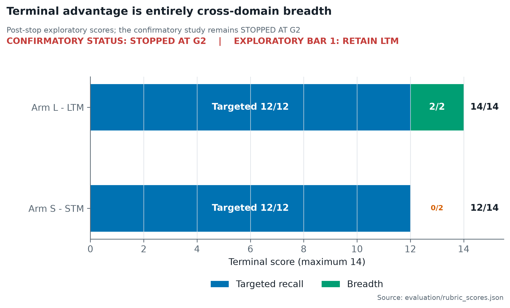
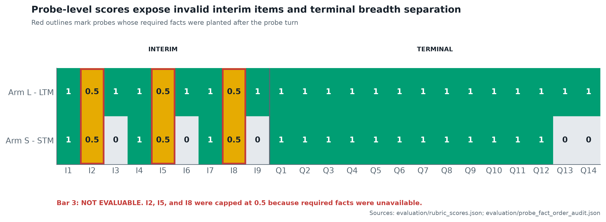
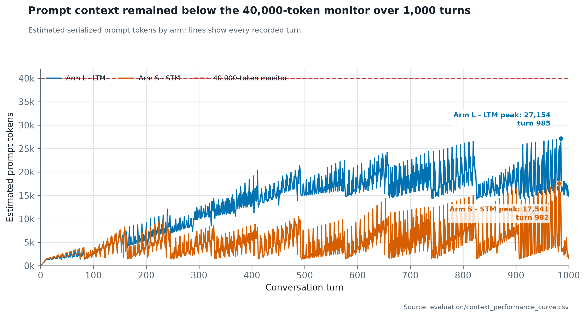

# Study 010 Report: Endurance Study Stopped at Scale Gate

**Pre-registration commit:** `ead2f663c3a149307a91eab3ab1c62ffafdc38a9`
**Study 009 dependency merge:** `8520bfe`
**Initial artifact lock:** `52f05e7`
**Final status:** STOPPED AT G2; POST-STOP EXPLORATORY CONTINUATION COMPLETE

> **Post-publication correction (2026-07-29):** Arm L's Q13/Q14 LTM blocks
> serialized to 53,726/53,839 characters against `B_ltm = 32,000`, violating
> the budget by 67.9%/68.2%. The reported 31,991/31,847 values were undercharged
> source-content totals. The compact-store scaling conclusion is withdrawn.
> Scores remain descriptions of the prompts the model received, but Arm L was
> not budget compliant. The separate 27,154 context peak survives a
> serialized-prompt audit under the registered `characters // 4` estimator.
> See `ERRATA.md` and `experiments/components/rendering_expansion/`.

## Result

Study 010 reached its offline scale gates but did not reach rehearsal or the
two 1,000-turn live runs. The accepted topic-assignment/consolidation layer
cannot represent the locked 12-domain script without either mass merging or
fragmentation.

This is a binding feasibility result, not an STM-versus-LTM score. No Bar 1
verdict can be made.

## Repairs

Amendment 001 repaired the inherited protocol: Study 009 supplied its decisive
LTM-value verdict; digest carry resolved false; Arm L remained the accepted
Study 007 treatment; architecture-aware parity replaced impossible cross-arm
byte identity; and checkpoint/restore plus blinded agent scoring were defined.

The script/rubric/key triple then locked at 1,000 turns, 12 domains, 36 plants,
nine interim probes, and fourteen terminal probes.

The first G2 replay exposed a script defect: eight generic filler templates
were repeated across domains. Amendment 002 replaced only filler wording with
domain-specific, non-scored facets and explicit thread boundaries. Plants,
plant turns, probes, rubric, and architecture remained unchanged. Failed gate
attempts are preserved under `gates/attempt_001/` and `gates/attempt_002/`.

## Gate Results

| Gate | Result |
|---|---|
| G1 retrieval at scale | PASS |
| G2 consolidation at scale | **FAIL - binding STOP** |
| G3 digest at scale | NOT APPLICABLE |
| G4 checkpoint/restore | PASS |
| Leakage audit | PASS |
| G5 200-turn rehearsal | NOT RUN |

G1 scanned 986 synthetic episodes. Every terminal targeted query recovered its
domain's early and middle plant sources, peak projected K context was 7,696
tokens, and mean/max scan latency was 52.25/58.60 ms.

G2 swept eight assignment/merge threshold pairs. Topic counts ranged from 2
to 135; no pair produced 10-18 topics with zero mixed-domain topics. The
closest count was 14 topics at 0.55/0.75, but eight were mixed. Full results
are in `gates/gate_results.json`.

## Consequence

The rehearsal, live arms, blinded scoring, degradation curves, and Bars 1-3
are not evaluable. Running them would knowingly violate the pre-registered
scale gate.

The next study must be a topic-architecture construction study against this
frozen 1,000-turn replay. Candidate changes such as supervised boundary
signals, adaptive assignment, or a different clustering objective must be
registered as treatments rather than silently inserted into Study 010.

## Post-Audit Addendum

Amendment 003 incorporates the completed Study 009 audits without editing the
locked registration or prior decisions. Study 009 Arm S is corrected from
10.5/13.0 to 9.0/13.0, so L's same-seed advantage was 3.0 points. The
duplication audit also found zero rendered LTM overlap with STM plus recency
after containment dedup, and the baseline audit showed that K retrieval had
already collapsed at the turn-120 breadth probe in Arm S.

Accordingly, Study 010 is a proposed scale extension of an advantage already
observed at 120 turns, not the first fair STM-versus-LTM comparison. These
interpretive corrections do not affect the independent G2 failure or reopen
the study.

## Authorized Exploratory Continuation

Amendment 004 records the author's authorization to run the locked experiment
after the stop while preserving G2 as failed and the confirmatory outcome as
stopped. The carried TopicManager and registered thresholds were unchanged.
G1, G4, and leakage passed again; G2 failed again. A two-arm 200-turn
rehearsal passed after Amendments 005-006 prevented the inapplicable rule
classifier from persisting false rules without changing decoded conversation
answers.

That repair followed a second carried-subsystem scale failure. Before the
amendments, the rule detector persisted 118 false rules by rehearsal turn 200,
grew the pinned block to about 5,512 tokens, and triggered cross-domain
refusals from turn 84. Amendments 005-006 made the continuation executable by
forcing persistence off symmetrically. The final zero-rule stores therefore
do not validate rule retention; they show that the failed behavior was
bypassed.

Both full arms then completed 1,000 turns. Arm L resumed from its verified
turn-500 checkpoint after the initial process was reaped during turn 597; Arm
S completed in one process. Both produced all ten checkpoints and all 23
registered probe answers.

### Exploratory Scores

Three clean-context blind rating passes completed the standing calibration
gate. Six strict-score disagreements were independently adjudicated before
the mapping was opened. The score artifact was committed at `32ffed4a`.

| Arm | Interim / 9 | Terminal / 14 | All probes / 23 |
|---|---:|---:|---:|
| L | 7.5 | 14.0 | 21.5 |
| S | 4.5 | 12.0 | 16.5 |

L's 2.0-point terminal advantage clears the registered 1.5-point Bar 1
threshold. The post-stop exploratory consequence is **RETAIN LTM**.

The gap is entirely breadth. Both arms scored 12.0/12.0 on terminal targeted
questions. L answered both breadth probes perfectly; S scored zero on both.
At Q13 and Q14, L's LTM block delivered all 12 required pairs. S's prompt
delivered only two and one respectively.

*Figure 1. Terminal score decomposition. Both arms earned all 12 targeted
points; the exploratory 2-point advantage came entirely from the two
cross-domain breadth probes. The banner preserves the inferential boundary:
the registered confirmatory study stopped at G2, while RETAIN LTM is a
post-stop exploratory result. Source: `evaluation/rubric_scores.json`.*

### Exploratory Bars

| Registered measure | Post-stop result |
|---|---|
| Bar 1 decision | RETAIN LTM: L - S = 2.0 terminal |
| Bar 2 endurance integrity | PASS |
| Bar 3 degradation curves | **NOT EVALUABLE** |

These are explicitly exploratory computations. They do not make the original
confirmatory study VALIDATED.

Arm L peaked at 27,154 estimated context tokens and Arm S at 17,541, both
below the 40,000-token monitor. L formed 290 offset-verbatim content records
across 63 dream events with zero non-content records and zero dream inference
calls. Both arms persisted zero rules.

The topic failure remained visible: both live arms ended with two topics. Arm
S nevertheless logged 203 K retrieval events across the 12 terminal targeted
turns, and `<retrieved_stm>` contained all 60 required targeted facts. The
targeted tie is genuine long-range STM retrieval, not recency-only recall.
The result supports LTM's cross-domain breadth value under the failed carried
topic layer; it does not show an LTM advantage for single-domain targeted
recall.

The registered degradation curves have a construction defect. I2, I5, and I8
ask for specification and threshold facts before those facts are planted,
making 0.5 the maximum reachable score for each item. Both arms reached that
maximum. The apparent interim-to-terminal improvement is therefore not a
degradation finding; it reflects unavailable interim facts and a different
question mix. Scored checkpoints alone do not deliver the complete degradation
curves Bar 3 required, so Bar 3 is **NOT EVALUABLE**. See
`evaluation/targeted_and_curve_validity_audit.md`.

*Figure 2. Primary score for every registered probe and arm. Red outlines mark
I2, I5, and I8, whose required facts were planted after the probe turn; their
0.5 scores are therefore maxima under a construct-invalid instrument rather
than evidence of degradation. Q13-Q14 are the breadth probes. Sources:
`evaluation/rubric_scores.json` and
`evaluation/probe_fact_order_audit.json`.*

*Figure 3. Estimated serialized prompt tokens at every turn of both 1,000-turn
runs. Peaks were 27,154 tokens for L and 17,541 for S, below the registered
40,000-token monitor. The sawtooth pattern reflects changing retrieved
context, not missing observations. Source:
`evaluation/context_performance_curve.csv`.*

### Forward Scale Risk

**Withdrawn.** This section originally classified the breadth win as potentially
compact-store dependent from the 18,951-character distilled store and reported
31,991/31,847 LTM charges. Those quantities do not measure the serialized
candidate store and selected block respectively. The actual selected blocks
were 53,726/53,839 characters, so Arm L silently exceeded its registered budget.
The original scaling inference does not follow from these data.

The remaining result is narrower: the model answered from the oversized blocks
it received. Exact-cost replay selects 69/71 episodes at 31,993/31,796
characters, but no inference was run on those compliant selections. Study 010
therefore does not establish whether breadth survives exact 32k charging.

*Withdrawn Figure 4. Panel A remains descriptive: L delivered 12/12 required
breadth pairs at both probes, versus 2/12 and 1/12 for S. Panel B is
invalidated. Its 31,991/31,847 values undercharged the actual
53,726/53,839-character blocks, and the 10x projection mixed non-equivalent
quantities. Sources:
`evaluation/fact_delivery_matrix.csv`, `ERRATA.md`, and
`experiments/components/rendering_expansion/`.*

### Standing Corrections

Study 010 demonstrates that two carried subsystems failed at scale:
TopicManager collapsed 12 domains into two topics, and the rule detector
accumulated false persistent rules until persistence was disabled. Both had
survived the 120-turn program. "Settled infrastructure" described a lack of
prior long-horizon testing, not established scale robustness. See
`evaluation/carried_subsystems_scale_audit.md`.

A new mechanical pre-lock check now requires every rubric fact to appear in a
scripted user turn strictly before its probe. Retrospective execution fails
exactly I2, I5, and I8 and is preserved in
`evaluation/probe_fact_order_audit.json`.

Complete scoring, fact delivery, curves, integrity checks, and mechanism
analysis are under `experiments/study_010/evaluation/`.

## Figure Reproducibility

All figures are generated by `scripts/generate_study_010_figures.py` from
committed tabular and JSON artifacts. Vector SVG and 300 dpi PNG versions are
preserved under `experiments/study_010/figures/`. The machine-readable
`figure_manifest.json` records every output and the SHA-256 digest of every
source artifact used to produce it.
